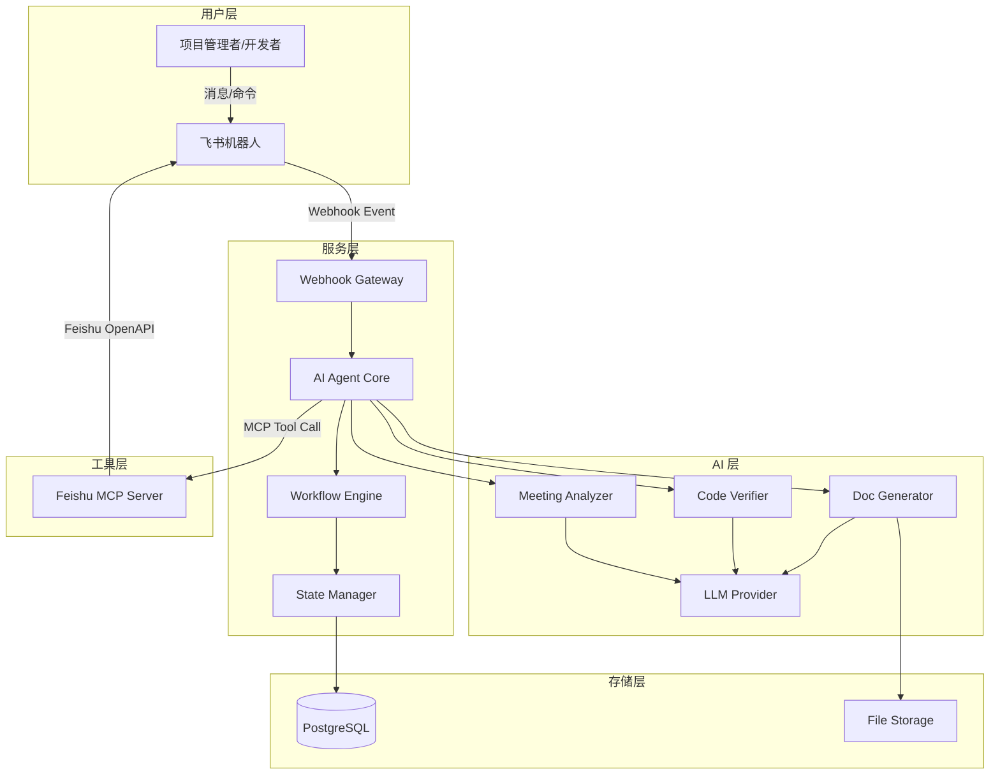
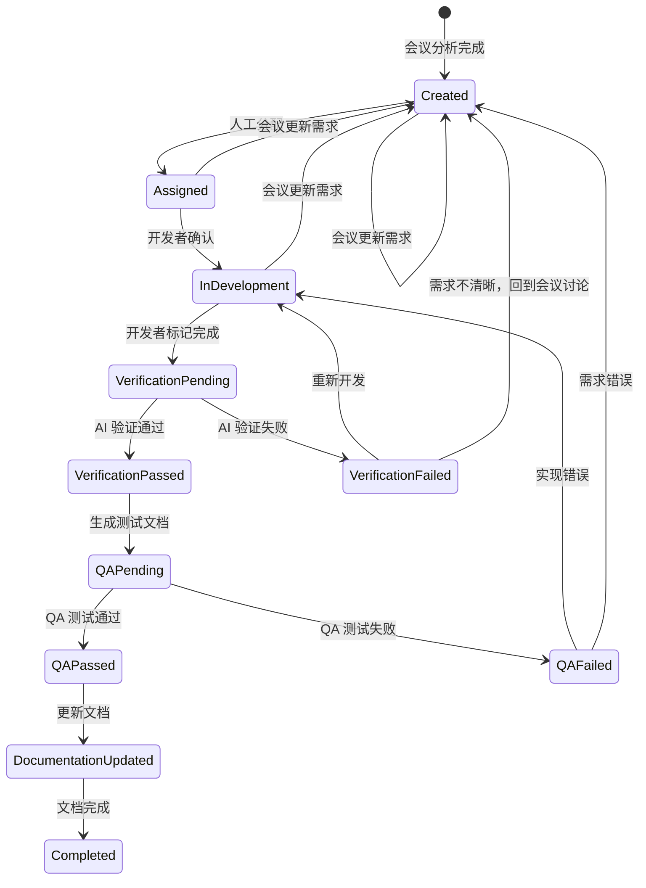

# Design Document: Feishu Helper

## Overview

Feishu Helper 是一个基于 AI Agent + 飞书 MCP 的后端服务，将飞书会议纪要自动转化为可执行的开发任务，并贯穿整个开发生命周期。系统采用事件驱动架构，以飞书机器人作为用户交互入口，AI Agent（LLM）作为核心决策大脑，飞书官方 MCP（`@larksuiteoapi/lark-mcp`）作为操作飞书平台的工具层。

**核心流程**：用户通过飞书机器人上传会议内容 → AI Agent 分析并决策 → 通过飞书 MCP 执行飞书操作（创建任务、更新文档等） → 人工通过飞书消息确认/分配 → 循环推进工作流。

**关键设计决策**：
1. **使用飞书官方 MCP**：采用 `@larksuiteoapi/lark-mcp` 作为飞书 API 的统一接入层，避免直接封装 REST API
2. **状态机驱动**：每个任务通过有限状态机管理生命周期，确保流程可追踪、可回溯
3. **人机协作模式**：AI 负责分析和生成，人工负责确认和分配，通过飞书消息通知实现交互

## Architecture

### 系统架构图



### 工作流状态机



### 技术栈选型

| 层级 | 技术选型 | 理由 |
|------|----------|------|
| 运行时 | Node.js (TypeScript) | 与飞书 MCP 生态一致，异步 I/O 适合事件驱动 |
| AI Agent 框架 | LangChain.js | 成熟的 Agent 框架，支持 Tool Calling 和 MCP 集成 |
| 飞书集成 | @larksuiteoapi/lark-mcp | 飞书官方 MCP，封装完整的 OpenAPI |
| LLM Provider | OpenAI GPT-4 / Claude | 支持 Function Calling，分析能力强 |
| 数据库 | PostgreSQL | 支持 JSONB 存储灵活的任务元数据 |
| 消息队列 | BullMQ (Redis) | 处理异步工作流任务，支持重试和延迟 |
| Web 框架 | Fastify | 高性能，适合 Webhook 处理 |

## Components and Interfaces

### 1. Webhook Gateway

负责接收飞书机器人的事件回调，验证签名，分发事件。

```typescript
interface WebhookGateway {
  // 接收飞书事件回调
  handleEvent(event: FeishuEvent): Promise<void>;
  // 验证请求签名
  verifySignature(headers: Record<string, string>, body: string): boolean;
  // URL 验证（飞书要求）
  handleChallenge(challenge: string): { challenge: string };
}

interface FeishuEvent {
  schema: string;
  header: {
    event_id: string;
    event_type: string;
    create_time: string;
    token: string;
    app_id: string;
  };
  event: {
    message?: MessageEvent;
    action?: CardActionEvent;
  };
}

interface MessageEvent {
  message_id: string;
  chat_id: string;
  chat_type: string;
  content: string;
  sender: { sender_id: { user_id: string } };
}
```

### 2. AI Agent Core

核心 Agent 模块，协调 LLM 调用和工具使用。

```typescript
interface AgentCore {
  // 处理用户输入，决策下一步动作
  processInput(input: AgentInput): Promise<AgentOutput>;
  // 执行 MCP 工具调用
  callTool(toolName: string, params: Record<string, unknown>): Promise<ToolResult>;
  // 获取对话上下文
  getContext(sessionId: string): Promise<ConversationContext>;
}

interface AgentInput {
  sessionId: string;
  userId: string;
  messageType: 'text' | 'file' | 'command' | 'callback';
  content: string;
  metadata?: Record<string, unknown>;
}

interface AgentOutput {
  actions: AgentAction[];
  response?: string;
  nextState?: TaskState;
}

type AgentAction =
  | { type: 'send_message'; chatId: string; content: string }
  | { type: 'create_task'; task: TaskCreateParams }
  | { type: 'update_task'; taskId: string; updates: Partial<Task> }
  | { type: 'generate_document'; docType: DocType; context: DocContext }
  | { type: 'verify_code'; taskId: string; codeRef: string };
```

### 3. Meeting Analyzer

会议纪要分析模块，提取结构化信息。

```typescript
interface MeetingAnalyzer {
  // 分析会议纪要内容
  analyze(content: string): Promise<MeetingAnalysis>;
  // 提取行动项
  extractActionItems(content: string): Promise<ActionItem[]>;
  // 生成结构化摘要
  generateSummary(content: string): Promise<MeetingSummary>;
}

interface MeetingAnalysis {
  summary: MeetingSummary;
  actionItems: ActionItem[];
  decisions: Decision[];
  discussionPoints: DiscussionPoint[];
}

interface MeetingSummary {
  title: string;
  date: string;
  participants: string[];
  keyPoints: string[];
  overallSummary: string;
}

interface ActionItem {
  id: string;
  description: string;
  context: string;
  priority: 'high' | 'medium' | 'low';
  suggestedAssignee?: string;
  dependencies: string[];
  acceptanceCriteria: string[];
}
```

### 4. Task Manager

任务管理模块，通过飞书 MCP 操作任务。

```typescript
interface TaskManager {
  // 创建任务
  createTask(params: TaskCreateParams): Promise<Task>;
  // 拆分子任务
  splitTask(taskId: string, subtasks: SubTaskParams[]): Promise<SubTask[]>;
  // 更新任务描述
  updateTaskDescription(taskId: string, description: string, reason: string): Promise<Task>;
  // 更新任务状态
  updateTaskState(taskId: string, newState: TaskState, trigger: string): Promise<Task>;
  // 获取任务详情
  getTask(taskId: string): Promise<Task>;
  // 列出项目任务
  listTasks(filter: TaskFilter): Promise<Task[]>;
}

interface TaskCreateParams {
  title: string;
  description: string;
  acceptanceCriteria: string[];
  dependencies: string[];
  priority: 'high' | 'medium' | 'low';
  sourceActionItemId: string;
  meetingId: string;
}

interface SubTaskParams {
  title: string;
  description: string;
  scope: string;
  estimatedEffort?: string;
}
```

### 5. Code Verifier

代码验证模块，对比实现与需求。

```typescript
interface CodeVerifier {
  // 验证代码是否符合任务描述
  verify(taskId: string, codeContext: CodeContext): Promise<VerificationReport>;
}

interface CodeContext {
  taskDescription: string;
  acceptanceCriteria: string[];
  codeChanges: string;  // diff 或代码片段
  commitMessage?: string;
}

interface VerificationReport {
  taskId: string;
  status: 'passed' | 'failed' | 'ambiguous';
  matchScore: number;  // 0-100
  analysis: {
    matchedCriteria: string[];
    unmatchedCriteria: string[];
    discrepancies: Discrepancy[];
    recommendations: string[];
  };
  generatedAt: string;
}

interface Discrepancy {
  criterion: string;
  expected: string;
  actual: string;
  severity: 'critical' | 'major' | 'minor';
}
```

### 6. Doc Generator

文档生成模块。

```typescript
interface DocGenerator {
  // 生成测试文档
  generateTestDocument(task: Task): Promise<TestDocument>;
  // 更新 MD 文档
  updateMDDocument(docId: string, content: DocUpdateContent): Promise<MDDocument>;
  // 编译使用手册
  compileUserManual(docIds: string[]): Promise<UserManual>;
}

interface TestDocument {
  taskId: string;
  testCases: TestCase[];
  generatedAt: string;
}

interface TestCase {
  id: string;
  title: string;
  type: 'positive' | 'negative' | 'boundary';
  preconditions: string[];
  steps: TestStep[];
  expectedResult: string;
}

interface TestStep {
  order: number;
  action: string;
  expectedOutcome?: string;
}

interface MDDocument {
  id: string;
  title: string;
  sections: DocSection[];
  version: string;
  lastUpdated: string;
}

interface DocSection {
  heading: string;
  level: number;
  content: string;
  subsections?: DocSection[];
}
```

### 7. Workflow Engine

工作流引擎，编排任务生命周期。

```typescript
interface WorkflowEngine {
  // 启动工作流
  startWorkflow(meetingAnalysis: MeetingAnalysis): Promise<string>;
  // 推进工作流
  advanceWorkflow(taskId: string, event: WorkflowEvent): Promise<void>;
  // 回退工作流
  revertWorkflow(taskId: string, targetState: TaskState, reason: string): Promise<void>;
  // 获取工作流状态
  getWorkflowStatus(taskId: string): Promise<WorkflowStatus>;
}

interface WorkflowEvent {
  type: 'assignment' | 'dev_complete' | 'verification_result' | 'qa_result' | 'doc_updated' | 'meeting_update';
  payload: Record<string, unknown>;
  actor: string;
  timestamp: string;
}

interface WorkflowStatus {
  taskId: string;
  currentState: TaskState;
  history: StateTransition[];
  retryCount: number;
  failureContext?: string;
}

interface StateTransition {
  fromState: TaskState;
  toState: TaskState;
  trigger: string;
  actor: string;
  timestamp: string;
  reason?: string;
}
```

### 8. State Manager

状态管理模块，持久化任务状态和转换历史。

```typescript
interface StateManager {
  // 获取当前状态
  getCurrentState(taskId: string): Promise<TaskState>;
  // 执行状态转换
  transition(taskId: string, toState: TaskState, context: TransitionContext): Promise<boolean>;
  // 验证转换是否合法
  validateTransition(fromState: TaskState, toState: TaskState): boolean;
  // 获取转换历史
  getTransitionHistory(taskId: string): Promise<StateTransition[]>;
  // 获取重试计数
  getRetryCount(taskId: string): Promise<number>;
}

type TaskState =
  | 'Created'
  | 'Assigned'
  | 'InDevelopment'
  | 'VerificationPending'
  | 'VerificationPassed'
  | 'VerificationFailed'
  | 'QAPending'
  | 'QAPassed'
  | 'QAFailed'
  | 'DocumentationUpdated'
  | 'Completed';

interface TransitionContext {
  trigger: string;
  actor: string;
  reason?: string;
  metadata?: Record<string, unknown>;
}
```

## Data Models

### 核心数据模型

```typescript
// 任务实体
interface Task {
  id: string;
  title: string;
  description: string;
  acceptanceCriteria: string[];
  dependencies: string[];
  priority: 'high' | 'medium' | 'low';
  state: TaskState;
  assignee?: string;
  parentTaskId?: string;  // 子任务关联
  meetingId: string;
  sourceActionItemId: string;
  feishuTaskId?: string;  // 飞书任务 ID
  retryCount: number;
  failureContext?: string;
  descriptionHistory: DescriptionUpdate[];
  createdAt: string;
  updatedAt: string;
}

interface DescriptionUpdate {
  previousDescription: string;
  newDescription: string;
  reason: string;
  updatedBy: string;
  updatedAt: string;
}

// 会议记录
interface Meeting {
  id: string;
  title: string;
  date: string;
  feishuDocId: string;  // 飞书文档 ID
  rawContent: string;
  analysis: MeetingAnalysis;
  createdTasks: string[];  // 关联的任务 ID
  createdAt: string;
}

// 任务分配关系
interface TaskAssignment {
  id: string;
  taskId: string;
  assigneeId: string;
  assigneeName: string;
  assignedBy: string;
  assignedAt: string;
  status: 'active' | 'reassigned' | 'completed';
}

// 验证报告
interface StoredVerificationReport {
  id: string;
  taskId: string;
  report: VerificationReport;
  codeContext: CodeContext;
  createdAt: string;
}

// 工作流日志
interface WorkflowLog {
  id: string;
  taskId: string;
  fromState: TaskState;
  toState: TaskState;
  trigger: string;
  actor: string;
  reason?: string;
  metadata?: Record<string, unknown>;
  timestamp: string;
}

// QA 反馈
interface QAFeedback {
  id: string;
  taskId: string;
  result: 'passed' | 'failed';
  failureType?: 'requirement_error' | 'implementation_error';
  details: string;
  testCaseResults: TestCaseResult[];
  reportedBy: string;
  reportedAt: string;
}

interface TestCaseResult {
  testCaseId: string;
  status: 'passed' | 'failed' | 'skipped';
  actualResult?: string;
  notes?: string;
}
```

### 数据库 Schema

```sql
-- 任务表
CREATE TABLE tasks (
  id UUID PRIMARY KEY DEFAULT gen_random_uuid(),
  title VARCHAR(500) NOT NULL,
  description TEXT NOT NULL,
  acceptance_criteria JSONB NOT NULL DEFAULT '[]',
  dependencies JSONB NOT NULL DEFAULT '[]',
  priority VARCHAR(10) NOT NULL DEFAULT 'medium',
  state VARCHAR(30) NOT NULL DEFAULT 'Created',
  assignee_id VARCHAR(100),
  parent_task_id UUID REFERENCES tasks(id),
  meeting_id UUID NOT NULL REFERENCES meetings(id),
  source_action_item_id VARCHAR(100),
  feishu_task_id VARCHAR(100),
  retry_count INTEGER NOT NULL DEFAULT 0,
  failure_context TEXT,
  description_history JSONB NOT NULL DEFAULT '[]',
  created_at TIMESTAMPTZ NOT NULL DEFAULT NOW(),
  updated_at TIMESTAMPTZ NOT NULL DEFAULT NOW()
);

-- 会议表
CREATE TABLE meetings (
  id UUID PRIMARY KEY DEFAULT gen_random_uuid(),
  title VARCHAR(500),
  meeting_date TIMESTAMPTZ,
  feishu_doc_id VARCHAR(100) NOT NULL,
  raw_content TEXT,
  analysis JSONB,
  created_at TIMESTAMPTZ NOT NULL DEFAULT NOW()
);

-- 工作流日志表
CREATE TABLE workflow_logs (
  id UUID PRIMARY KEY DEFAULT gen_random_uuid(),
  task_id UUID NOT NULL REFERENCES tasks(id),
  from_state VARCHAR(30) NOT NULL,
  to_state VARCHAR(30) NOT NULL,
  trigger VARCHAR(100) NOT NULL,
  actor VARCHAR(100) NOT NULL,
  reason TEXT,
  metadata JSONB,
  timestamp TIMESTAMPTZ NOT NULL DEFAULT NOW()
);

-- 任务分配表
CREATE TABLE task_assignments (
  id UUID PRIMARY KEY DEFAULT gen_random_uuid(),
  task_id UUID NOT NULL REFERENCES tasks(id),
  assignee_id VARCHAR(100) NOT NULL,
  assignee_name VARCHAR(200) NOT NULL,
  assigned_by VARCHAR(100) NOT NULL,
  assigned_at TIMESTAMPTZ NOT NULL DEFAULT NOW(),
  status VARCHAR(20) NOT NULL DEFAULT 'active'
);

-- 验证报告表
CREATE TABLE verification_reports (
  id UUID PRIMARY KEY DEFAULT gen_random_uuid(),
  task_id UUID NOT NULL REFERENCES tasks(id),
  report JSONB NOT NULL,
  code_context JSONB NOT NULL,
  created_at TIMESTAMPTZ NOT NULL DEFAULT NOW()
);

-- QA 反馈表
CREATE TABLE qa_feedbacks (
  id UUID PRIMARY KEY DEFAULT gen_random_uuid(),
  task_id UUID NOT NULL REFERENCES tasks(id),
  result VARCHAR(10) NOT NULL,
  failure_type VARCHAR(30),
  details TEXT,
  test_case_results JSONB NOT NULL DEFAULT '[]',
  reported_by VARCHAR(100) NOT NULL,
  reported_at TIMESTAMPTZ NOT NULL DEFAULT NOW()
);

-- 文档表
CREATE TABLE documents (
  id UUID PRIMARY KEY DEFAULT gen_random_uuid(),
  title VARCHAR(500) NOT NULL,
  doc_type VARCHAR(30) NOT NULL, -- 'test_doc', 'md_doc', 'user_manual'
  content TEXT,
  sections JSONB,
  version VARCHAR(20) NOT NULL DEFAULT '1.0.0',
  related_task_id UUID REFERENCES tasks(id),
  feishu_doc_id VARCHAR(100),
  created_at TIMESTAMPTZ NOT NULL DEFAULT NOW(),
  updated_at TIMESTAMPTZ NOT NULL DEFAULT NOW()
);
```

## Correctness Properties

*A property is a characteristic or behavior that should hold true across all valid executions of a system—essentially, a formal statement about what the system should do. Properties serve as the bridge between human-readable specifications and machine-verifiable correctness guarantees.*

### Property 1: Meeting Analysis Completeness

*For any* meeting content string of any length (including very long content), the Meeting Analyzer SHALL produce a structured output that contains non-empty key decisions, action items, and discussion points fields, and the combined content of these fields SHALL reference all substantive content from the input without truncation.

**Validates: Requirements 1.2, 1.3**

### Property 2: Task Creation Completeness

*For any* set of action items produced by the Meeting Analyzer, the Task Manager SHALL create a corresponding task for each action item, and each task's description SHALL contain context, acceptance criteria, and dependencies fields that are non-empty and derived from the source action item.

**Validates: Requirements 2.1, 2.3**

### Property 3: Task Splitting Scope Boundaries

*For any* complex task that is split into subtasks, the union of all subtask scopes SHALL cover the parent task's scope, and no two subtasks SHALL have overlapping scope descriptions (i.e., each subtask addresses a distinct aspect of the parent task).

**Validates: Requirements 2.2**

### Property 4: Task Description History Preservation

*For any* sequence of N description updates applied to a task, the task's description history SHALL contain exactly N entries, each with the previous description, new description, modification reason, and timestamp, in chronological order.

**Validates: Requirements 2.5**

### Property 5: Assignment Mapping Consistency

*For any* sequence of task assignments, the system SHALL maintain a mapping where every active assignment has a valid task-developer pair, and querying the mapping for any assigned task SHALL return the correct current assignee.

**Validates: Requirements 3.1, 3.3**

### Property 6: Verification Report Structure

*For any* code verification operation (regardless of pass/fail outcome), the generated Verification Report SHALL contain a match analysis section, a discrepancies list, and a recommendations list, and the matched + unmatched criteria SHALL together equal the full set of task acceptance criteria.

**Validates: Requirements 4.2**

### Property 7: Test Document Completeness

*For any* task with N acceptance criteria that passes verification, the generated Test Document SHALL contain at least one positive test case, one negative test case, and one boundary condition test case, and every test case SHALL have non-empty preconditions, test steps, and expected results fields.

**Validates: Requirements 5.1, 5.2, 5.3**

### Property 8: QA Feedback Association

*For any* QA feedback submitted for a task, the feedback record SHALL be persistently associated with the correct task ID, and querying all feedback for that task SHALL include the submitted feedback.

**Validates: Requirements 6.4**

### Property 9: Document Update Preservation

*For any* existing MD document with N sections, after an update operation, the resulting document SHALL still contain all N original sections (possibly modified), SHALL have an incremented version number, and SHALL have an updated last-modified timestamp that is greater than or equal to the previous timestamp.

**Validates: Requirements 7.2, 7.3**

### Property 10: User Manual Compilation Completeness

*For any* set of N MD documents, the compiled User Manual SHALL include content from all N documents, SHALL have a table of contents with entries for each document, and SHALL contain cross-references between related sections.

**Validates: Requirements 8.1, 8.2**

### Property 11: User Manual Incremental Update

*For any* User Manual and a single updated MD document, regenerating the manual SHALL only modify sections derived from the updated document, while all other sections SHALL remain byte-identical to the previous version.

**Validates: Requirements 8.4**

### Property 12: State Machine Correctness

*For any* task in state S and any attempted transition to state T, the transition SHALL succeed if and only if (S, T) is in the set of valid transitions defined by the state machine. Invalid transitions SHALL be rejected and SHALL not modify the task's state.

**Validates: Requirements 9.1, 9.3**

### Property 13: State Transition Logging

*For any* successful state transition, the system SHALL create a log entry containing the from-state, to-state, trigger reason, actor identifier, and a timestamp that is monotonically increasing relative to previous log entries for the same task.

**Validates: Requirements 9.2**

### Property 14: Retry Counter on Failure Revert

*For any* task that transitions back to a previous state due to a failure event, the task's retry counter SHALL be incremented by exactly 1, and the failure context SHALL be non-empty and describe the failure reason.

**Validates: Requirements 9.4**

### Property 15: Meeting Update Triggers Revert

*For any* task in a state beyond "Created" (i.e., Assigned, InDevelopment, VerificationPending, etc.), when a meeting update affects that task's requirements, the task SHALL be transitioned back to the "Created" state, and the workflow SHALL re-trigger from the task-update phase.

**Validates: Requirements 9.5**

### Property 16: Exponential Backoff Retry

*For any* sequence of N consecutive API failures (where N ≤ max retries), the delay before retry attempt K SHALL be proportional to 2^K (exponential backoff), ensuring each subsequent retry waits at least twice as long as the previous one.

**Validates: Requirements 10.2**

## Error Handling

### 错误分类与处理策略

| 错误类别 | 示例 | 处理策略 |
|----------|------|----------|
| 飞书 API 错误 | 网络超时、认证失败、限流 | 指数退避重试（最多 3 次），失败后通知管理员 |
| LLM 调用错误 | Token 超限、服务不可用 | 重试 2 次，降级到简化 prompt，失败后暂停工作流 |
| 状态转换错误 | 非法状态转换 | 拒绝操作，记录日志，通知用户当前状态和可用操作 |
| 数据验证错误 | 空内容、格式错误 | 返回明确错误信息，不执行操作 |
| 业务逻辑错误 | 任务不存在、重复分配 | 返回业务错误码和描述，建议用户操作 |

### 错误处理流程

```typescript
// 统一错误处理
interface AppError {
  code: string;           // 错误码，如 'FEISHU_API_TIMEOUT'
  category: ErrorCategory;
  message: string;        // 用户可读的错误描述
  details?: unknown;      // 技术细节（仅日志）
  retryable: boolean;     // 是否可重试
  suggestedAction?: string; // 建议用户操作
}

type ErrorCategory =
  | 'feishu_api'
  | 'llm_service'
  | 'state_transition'
  | 'validation'
  | 'business_logic';

// 重试策略
interface RetryPolicy {
  maxRetries: number;
  baseDelay: number;      // 毫秒
  maxDelay: number;       // 毫秒上限
  backoffMultiplier: number; // 指数退避倍数
}

const DEFAULT_RETRY_POLICIES: Record<ErrorCategory, RetryPolicy> = {
  feishu_api: { maxRetries: 3, baseDelay: 1000, maxDelay: 30000, backoffMultiplier: 2 },
  llm_service: { maxRetries: 2, baseDelay: 2000, maxDelay: 20000, backoffMultiplier: 2 },
  state_transition: { maxRetries: 0, baseDelay: 0, maxDelay: 0, backoffMultiplier: 0 },
  validation: { maxRetries: 0, baseDelay: 0, maxDelay: 0, backoffMultiplier: 0 },
  business_logic: { maxRetries: 0, baseDelay: 0, maxDelay: 0, backoffMultiplier: 0 },
};
```

### 降级策略

1. **LLM 降级**：当主 LLM 不可用时，切换到备用模型（如 GPT-4 → GPT-3.5）
2. **MCP 降级**：当飞书 MCP 不可用时，将操作入队，待恢复后批量执行
3. **通知降级**：当飞书消息发送失败时，记录待发送队列，定时重试

### 幂等性保证

- 所有飞书操作使用唯一请求 ID，防止重复创建
- 状态转换使用乐观锁（版本号），防止并发冲突
- 工作流事件使用事件 ID 去重

## Testing Strategy

### 测试分层

```
┌─────────────────────────────────────┐
│         E2E Tests (少量)             │
│   完整工作流端到端验证               │
├─────────────────────────────────────┤
│       Integration Tests (中量)       │
│   飞书 MCP 集成、LLM 调用、DB 操作   │
├─────────────────────────────────────┤
│     Property-Based Tests (核心)      │
│   状态机、数据转换、业务规则          │
├─────────────────────────────────────┤
│        Unit Tests (大量)             │
│   纯函数、工具函数、格式化逻辑        │
└─────────────────────────────────────┘
```

### Property-Based Testing

**框架选择**：[fast-check](https://github.com/dubzzz/fast-check)（TypeScript 生态最成熟的 PBT 库）

**配置要求**：
- 每个 property test 最少运行 100 次迭代
- 每个 property test 必须通过注释引用设计文档中的 property
- 标签格式：`Feature: feishu-helper, Property {number}: {property_text}`

**Property Tests 覆盖范围**：
- Property 12（状态机正确性）：生成随机状态和转换序列，验证只有合法转换成功
- Property 13（转换日志）：生成随机转换，验证日志完整性
- Property 14（重试计数器）：生成随机失败序列，验证计数器递增
- Property 15（会议更新回退）：生成各状态的任务，验证回退行为
- Property 16（指数退避）：生成随机重试序列，验证延迟公式
- Property 4（描述历史）：生成随机更新序列，验证历史完整性
- Property 9（文档更新保留）：生成随机文档和更新，验证结构保留
- Property 11（手册增量更新）：生成随机更新，验证只修改受影响部分

### Unit Tests

**覆盖范围**：
- Meeting Analyzer 的结构化输出解析
- Task Manager 的任务字段映射
- Doc Generator 的格式化逻辑
- 错误分类和错误消息生成
- 工具函数（日期格式化、ID 生成等）

### Integration Tests

**覆盖范围**：
- 飞书 MCP 工具调用（使用 mock MCP server）
- LLM 调用（使用 mock LLM 响应）
- 数据库 CRUD 操作
- Webhook 事件处理流程
- 认证和 Token 刷新

### E2E Tests

**覆盖范围**：
- 完整工作流：会议上传 → 任务创建 → 分配 → 验证 → QA → 文档
- 异常流程：API 失败重试、状态回退、需求变更

