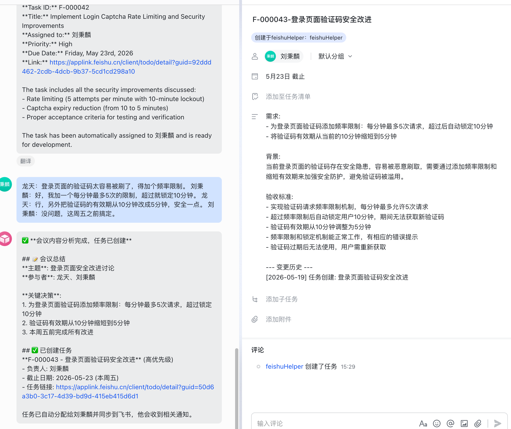
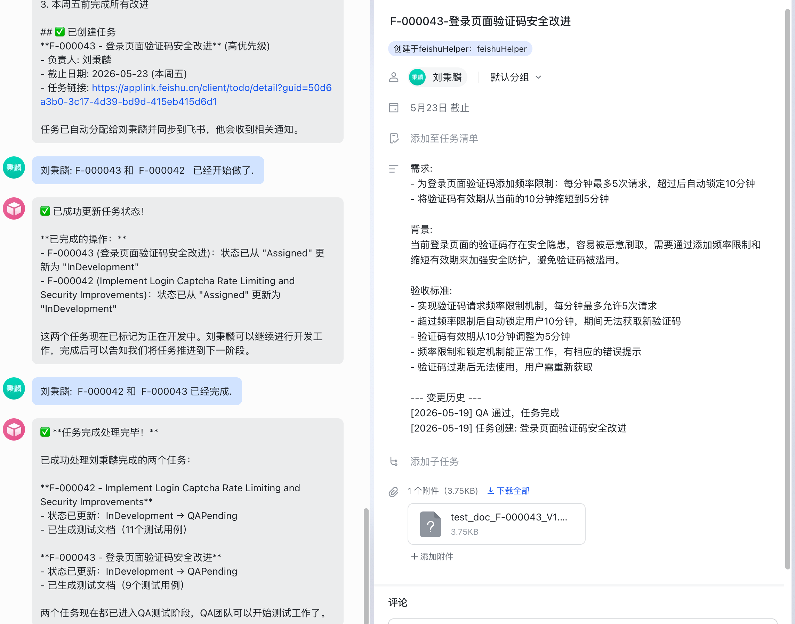

# Feishu Helper — 系统架构与功能详解

## 关于本项目

本项目由 **刘秉麟 (Dallas Liu)** 独立设计与指导，全程使用 AI 编程工具 (Kiro) 完成开发。从架构设计、技术选型、代码实现到测试验证，所有代码均由 AI 生成，人工负责方向把控、需求定义和质量审批。

这不是一个简单的"让 AI 写代码"的项目——它本身就是一个 **AI Agent 应用**，展示了对以下概念的深入理解：

- **LLM vs Agent vs App 的区别**：LLM 只能"想"，Agent 能"想+做"（工具调用），App 是完整产品（入口 + 持久化 + 业务流程 + Agent）
- **Tool-Calling Loop**：LLM 不是一次性回答，而是循环决策——思考 → 调工具 → 拿结果 → 再思考 → 直到完成
- **Prompt Engineering**：通过精确的 system prompt 控制 LLM 行为（描述格式、合并规则、日期解析、工具使用优先级）
- **Agent 与传统后端的结合**：Agent 做决策层，传统后端做持久化、状态管理、消息收发
- **读时同步 vs 事件订阅**：在没有 Webhook 事件的场景下，用"对比 + LLM 决策"实现数据同步

项目证明了一个观点：**理解 AI 系统的架构和原理，比会写代码更重要**。AI 可以写代码，但需要人来设计系统、定义边界、做架构决策。

---

## 一、项目简介

Feishu Helper 是一个基于 AI 的飞书工作流自动化系统。它通过飞书机器人接收消息，利用 LLM（Claude）理解用户意图，自动执行任务管理操作（创建、分配、状态推进、QA 反馈等），并将结果同步到飞书任务系统。

**一句话总结**：用户在飞书群里说话 → AI 理解并执行 → 飞书任务自动创建/更新/完成。

### 演示：会议对话 → 任务创建 → 任务完成

**从会议讨论中自动创建任务：**



**QA 通过后任务自动完成：**



---

## 二、核心功能

| 功能 | 描述 |
|------|------|
| 会议纪要分析 | 发送会议内容，AI 自动提取行动项并创建飞书任务 |
| 任务创建 | 直接说"帮我创建一个任务"，AI 创建飞书任务 + 本地数据库记录 |
| 任务分配 | 说"分配给刘秉麟"，AI 查员工表、分配任务、同步飞书 |
| 状态推进 | 说"开始做了"/"做完了"/"QA 通过"，AI 推进工作流状态 |
| QA 流程 | 生成测试文档、提交 QA 反馈、自动回退或完成 |
| 飞书同步 | 说"同步一下"，AI 对比飞书和本地数据差异并更新 |
| 代码验证 | 提交代码后 AI 对比需求生成验证报告（参考用） |

---

## 三、技术栈

- **运行时**：Node.js + TypeScript
- **HTTP 框架**：Fastify
- **AI/LLM**：LangChain.js + Claude (Anthropic)
- **飞书集成**：@larksuiteoapi/node-sdk（REST API + WebSocket 长连接）
- **数据库**：PostgreSQL
- **消息队列**：BullMQ + Redis
- **测试**：Vitest

---

## 四、完整请求流程（从消息到响应）

```
用户在飞书发消息
       │
       ▼
┌─────────────────┐
│  飞书 WebSocket  │  飞书平台通过长连接推送事件
│  (Feishu SDK)   │
└────────┬────────┘
         │ im.message.receive_v1 事件
         ▼
┌─────────────────┐
│   WsGateway     │  桥接飞书 SDK 事件格式 → 内部 EventDispatcher 格式
│  (wsGateway.ts) │
└────────┬────────┘
         │ dispatch(feishuEvent)
         ▼
┌─────────────────┐
│ EventDispatcher │  根据 event_type 路由到对应 handler
│(webhookGateway) │  注：EventDispatcher 只是一个路由器类，
│                 │  实际入口是 WsGateway，不走 HTTP Webhook
└────────┬────────┘
         │ im.message.receive_v1 → handleMessageEvent
         ▼
┌─────────────────┐
│ MessageHandler  │  三层防护（sender_type + create_time + message_id 去重）
│(messageHandler) │  解析消息内容 → 构建 AgentInput
└────────┬────────┘
         │ agentCore.processInput(input)
         ▼
┌─────────────────┐
│   AgentCore     │  LLM + 工具调用循环（最多 10 轮）
│  (agentCore.ts) │  Claude 决定调哪些工具 → 执行 → 反馈结果 → 再决定
└────────┬────────┘
         │ 最终文字回复
         ▼
┌─────────────────┐
│ Notification    │  通过飞书 REST API 发送回复消息
│   Service       │
└─────────────────┘
```

> **注意**：`webhookGateway.ts` 中的 `EventDispatcher` 类只是一个事件路由器（注册 handler + dispatch），不是 HTTP Webhook 入口。实际的消息入口是 `WsGateway`（WebSocket 长连接）。`webhookGateway.ts` 中的 Fastify 路由代码是早期设计遗留，当前未使用。

---

## 五、各层详解

### 5.1 飞书连接层（WsGateway）

**文件**：`src/gateway/wsGateway.ts`

**作用**：建立与飞书的 WebSocket 长连接，接收所有推送事件。

**工作原理**：
1. 使用 `@larksuiteoapi/node-sdk` 的 `WSClient`，传入 `appId` + `appSecret`
2. 注册事件处理器：`im.message.receive_v1`（用户消息）和 `card.action.trigger`（卡片按钮）
3. 飞书 SDK 自动处理：连接建立、断线重连、事件解密、签名验证
4. 收到事件后调 `bridgeEvent()`，将 SDK 的扁平数据格式转换为内部 `FeishuEvent` 格式
5. 转发给 `EventDispatcher` 进行路由

**为什么用长连接而不是 Webhook**：
- 不需要公网地址（开发环境友好）
- 不需要 ngrok/cloudflared
- SDK 自动重连，稳定性好

---

### 5.2 消息处理层（MessageHandler）

**文件**：`src/integration/messageHandler.ts`

**作用**：接收路由过来的事件，做安全过滤，然后交给 AgentCore 处理。

**三层防护机制**：
1. **sender_type 过滤**：忽略机器人自己发的消息（防止"收到→回复→收到回复"死循环）
2. **create_time 过滤**：丢弃超过 5 分钟的旧消息（防止断线重连后积压消息重放）
3. **message_id 去重**：内存 Set 记录已处理的消息 ID（防止网络抖动导致同一条消息推送两次）

**处理流程**：
1. 提取 `sender`、`message`、`chat_id`
2. 过三层防护
3. 解析消息内容（飞书发的是 JSON 编码的文本）
4. 构建 `AgentInput`（sessionId = message_id，确保每条消息独立上下文）
5. 调 `agentCore.processInput(input)`
6. 拿到回复后通过 `NotificationService` 发回飞书

---

### 5.3 AI Agent 核心（AgentCore）

**文件**：`src/agent/agentCore.ts` + `src/agent/agentCoreToolBoxRegister.ts`

**作用**：系统的"大脑"。接收用户意图，通过 LLM 决策，调用工具执行操作。

**核心机制 — Tool-Calling Loop**：

```
用户消息 → [System Prompt + 历史消息 + 用户消息] → 发给 Claude
                                                        │
                                                        ▼
                                              Claude 返回响应
                                                        │
                                          ┌─────────────┴─────────────┐
                                          │                           │
                                    有 tool_calls               纯文字回复
                                          │                           │
                                          ▼                           ▼
                                    执行每个工具                   返回给用户
                                    (调 DB/飞书 API)
                                          │
                                          ▼
                                    工具结果反馈给 Claude
                                          │
                                          ▼
                                    Claude 再次决策...
                                    (循环，最多 10 轮)
```

**System Prompt 包含**：
- 10 个工具的使用规则和优先级
- 完整数据库 schema（让 LLM 能写 SQL 查询）
- 任务描述格式规范（需求/背景/验收标准）
- 当前日期（动态注入，用于解析"这周三"等相对日期）
- 工作流规则（什么时候用什么工具）

**10 个工具**：

| # | 工具名 | 作用 |
|---|--------|------|
| 1 | analyze_meeting | 分析会议内容，提取行动项，存入 meetings 表 |
| 2 | query_sql | 通用只读 SQL 查询（查任务、员工、会议等） |
| 3 | create_feishu_task | 创建任务（写 DB + 调飞书 API + 自动分配） |
| 4 | update_task | 更新任务字段（标题/描述/优先级/截止日期） |
| 5 | assign_task | 分配任务给人（写 DB + 飞书 addMembers） |
| 6 | advance_task | 推进任务状态（走状态机） |
| 7 | verify_code | AI 代码验证（生成报告，不推进状态） |
| 8 | generate_test_doc | 生成 QA 测试文档（存 DB + 飞书附件） |
| 9 | submit_qa_feedback | 提交 QA 结果（存反馈 + 自动推进状态） |
| 10 | sync_task | 对比飞书和本地数据差异（只读，返回 diff） |

---

### 5.4 工作流状态机

**文件**：`src/workflow/stateMachine.ts`

**任务生命周期**：

```
Created → Assigned → InDevelopment → QAPending → QAPassed → Completed
                          ↑                         │
                          └─── QAFailed ←───────────┘
```

**状态转换规则**：
- `Created → Assigned`：任务被分配给人
- `Assigned → InDevelopment`：开发者确认接单
- `InDevelopment → QAPending`：开发完成，进入 QA
- `QAPending → QAPassed → Completed`：QA 通过，任务完成
- `QAPending → QAFailed → InDevelopment`：QA 失败，回到开发

**每次状态转换**：
- 验证转换合法性（非法转换直接拒绝）
- 写入 `workflow_logs` 表（审计日志）
- 使用乐观锁防止并发冲突

---

### 5.5 错误处理与重试（Errors + Retry）

**文件**：`src/utils/errors.ts` + `src/utils/retry.ts`

**错误分类**：

| 类别 | 是否重试 | 场景 |
|------|---------|------|
| feishu_api | ✅ 最多 3 次 | 飞书 API 超时、限流 |
| llm_service | ✅ 最多 2 次 | Claude API 超时、服务不可用 |
| state_transition | ❌ | 非法状态转换（如 Created → Completed） |
| validation | ❌ | 参数错误（空标题、无效 ID） |
| business_logic | ❌ | 业务规则违反（任务不存在、重复分配） |

**重试策略**：指数退避（1s → 2s → 4s），每次等待时间翻倍，避免打爆外部 API。

**错误传播路径**：
```
工具函数抛出 AppError
       │
       ▼
AgentCore 捕获 → 将错误信息作为工具结果返回给 Claude
       │
       ▼
Claude 看到错误 → 决定是否重试或告知用户
       │
       ▼
最终回复用户（成功结果或友好的错误提示）
```

---

### 5.6 飞书数据同步（FeishuSync）

**文件**：`src/services/feishuSync.ts`

**设计理念**：纯只读"侦察员"，不写任何东西。

**流程**：
1. 用户说"我在飞书上改了点东西，同步一下"
2. `sync_task` 工具调 `FeishuSyncService.diff(taskId)`
3. 拉飞书 API 获取任务最新状态
4. 查本地 DB 对比
5. 返回差异列表给 LLM
6. LLM 根据差异决定调 `update_task` 或 `assign_task`

**对比字段**：title、description、due_date、assignee_id
**不同步**：state（状态只能走状态机）

---

### 5.7 描述历史管理（syncDescriptionToFeishu）

**文件**：`src/agent/agentCoreToolBoxRegister.ts`（内部 helper）

**飞书任务描述格式**：
```
需求:
- xxx
- xxx

背景:
xxx

验收标准:
- xxx
- xxx

--- 变更历史 ---
[2026-05-18] QA 失败（实现问题）: TTL需要改为10小时
[2026-05-18] 任务创建: 实施验证码安全优化
```

**规则**：
- LLM 只写上面的内容部分（需求/背景/验收标准）
- `--- 变更历史 ---` 由代码自动管理
- 每次操作（创建、分配、QA 反馈等）自动追加一行历史
- 历史存在 DB 的 `description_history` JSONB 字段

---

## 六、数据库设计

| 表名 | 作用 |
|------|------|
| tasks | 任务主表（标题、描述、状态、负责人、飞书任务 ID） |
| meetings | 会议记录（原始内容 + AI 分析结果） |
| task_meetings | 任务-会议多对多关联 |
| employees | 团队花名册（name → open_id 映射） |
| workflow_logs | 状态转换审计日志 |
| task_assignments | 分配记录（支持重新分配历史） |
| verification_reports | AI 代码验证报告 |
| qa_feedbacks | QA 反馈记录 |
| documents | 生成的测试文档 |

---

## 七、启动流程

```typescript
main()
  ├── getConfig()           // 读取环境变量
  ├── getPool()             // 初始化 PostgreSQL 连接池
  ├── initQueues()          // 初始化 BullMQ 队列
  ├── initWorkers()         // 启动队列 Worker
  ├── buildApp()            // 构建 Fastify HTTP 服务（/health 端点）
  ├── app.listen()          // 启动 HTTP 服务器
  ├── AgentCore.initialize()// 初始化 LLM + 注册 10 个工具
  ├── registerMessageHandler()  // 注册事件处理器
  └── WsGateway.start()    // 建立飞书 WebSocket 长连接
```

**优雅关闭**（收到 SIGTERM/SIGINT）：
```
关闭 WebSocket → 关闭 HTTP → 关闭队列 → 关闭数据库连接池
```

---

## 八、关键设计决策

1. **飞书 MCP 不能在代码里直接调用** — 所有飞书操作统一用 `node-sdk` Client
2. **AgentCore 只做调度** — 工具函数调 Service 层，不直接操作数据库
3. **状态只能走状态机** — sync 不同步 state，飞书完成不影响本地状态
4. **描述历史由代码管理** — LLM 不写历史，只写内容
5. **sync_task 是侦察工具** — 只报告差异，由 LLM 决定怎么处理
6. **每条消息独立 session** — 避免历史失败上下文污染后续消息
7. **长连接模式** — 开发环境不需要公网地址


---

## 九、源文件逐个说明（按调用顺序）

以下按照一条消息从进入系统到返回结果的顺序，逐个解释每个源文件的作用。

---

### 第一层：启动与入口

#### `src/index.ts` — 程序入口
应用的 `main()` 函数。按顺序初始化所有组件：读配置 → 连数据库 → 启队列 → 启 HTTP 服务 → 初始化 AgentCore → 注册消息处理器 → 建立飞书 WebSocket 连接。也负责优雅关闭（SIGTERM/SIGINT 时按反序关闭所有资源）。

#### `src/app.ts` — Fastify HTTP 应用
构建 Fastify 实例，注册 `/health` 健康检查端点。HTTP 服务主要用于运维监控，实际消息不走 HTTP。

---

### 第二层：配置

#### `src/config/index.ts` — 应用配置
从环境变量读取所有配置项（飞书 App ID/Secret、LLM API Key、数据库连接、Redis 连接等），启动时验证必填项是否存在。所有模块通过 `getConfig()` 获取配置。

#### `src/config/database.ts` — 数据库连接池
管理 PostgreSQL 连接池（`pg` 库的 Pool）。提供 `getPool()`（获取/创建连接池）和 `closePool()`（关闭连接池）。

---

### 第三层：消息接收

#### `src/gateway/wsGateway.ts` — WebSocket 长连接网关（实际入口）
使用飞书 SDK 的 `WSClient` 建立 WebSocket 长连接。收到事件后将飞书 SDK 的扁平数据格式转换为内部 `FeishuEvent` 格式，然后交给 `EventDispatcher` 路由。这是消息进入系统的唯一入口。

#### `src/gateway/webhookGateway.ts` — 事件路由器 + Webhook（遗留）
定义了 `EventDispatcher` 类（注册 handler + 按 event_type 分发）和 `FeishuEvent` 类型。`EventDispatcher` 被 `WsGateway` 和 `MessageHandler` 共同使用。文件中的 Fastify Webhook 路由是早期设计，当前未使用（长连接模式不需要公网 Webhook）。

---

### 第四层：消息处理

#### `src/integration/messageHandler.ts` — 消息处理器
连接 EventDispatcher → AgentCore → NotificationService 的桥梁。注册 `im.message.receive_v1` 和 `card.action.trigger` 两个事件处理器。负责三层防护（防循环、防重放、防重复）、解析消息内容、构建 AgentInput、调 AgentCore、发送回复。

---

### 第五层：AI Agent

#### `src/agent/agentCore.ts` — Agent 核心
系统的"大脑"。管理 LLM 实例、会话上下文、工具注册。核心方法 `processInput()`：构建消息列表 → 发给 Claude → 如果 Claude 要调工具就执行 → 把结果反馈给 Claude → 循环直到 Claude 给出纯文字回复（最多 10 轮）。动态注入当前日期到 system prompt。

#### `src/agent/agentCoreToolBoxRegister.ts` — 工具注册
定义并导出 10 个 `DynamicStructuredTool`（LangChain 工具）。每个工具是一个独立的函数，接收参数、执行操作（调 Service 层 / 调飞书 API / 查 DB）、返回结果字符串。也包含 `syncDescriptionToFeishu` 辅助函数（管理飞书描述 + 历史）。

---

### 第六层：Service 层（业务逻辑）

#### `src/services/meetingAnalyzer.ts` — 会议分析器
调 LLM 分析会议纪要，返回结构化结果（摘要、行动项、决策、讨论点）。使用 Zod schema 强制 LLM 输出固定格式。支持长内容分段处理（切片 → 分别分析 → 合并去重）。被 `analyze_meeting` 工具调用。

#### `src/services/taskManager.ts` — 任务管理器
任务 CRUD 的核心 Service。`createTask()`：先写 DB 拿 display_id → 调飞书 API 创建任务 → 更新 DB 存 feishu_task_id。`splitTask()`：拆分子任务。`updateTaskDescription()`：更新描述 + 保留历史。`updateTaskState()`：调状态机执行状态转换。被 `create_feishu_task`、`update_task`、`advance_task`、`submit_qa_feedback` 等多个工具调用。

#### `src/services/taskAssignment.ts` — 任务分配管理
管理 `task_assignments` 表。`assignTask()`：创建分配记录，旧记录标记为 reassigned。`confirmAssignment()`：开发者确认接单。`completeAssignment()`：任务完成时标记分配为 completed。被 `assign_task` 工具调用。

#### `src/services/feishuSync.ts` — 飞书数据同步
纯只读 Service。`diff(taskId)`：拉飞书 API → 查 DB → 返回差异列表。不写任何东西。对比字段：title、description、due_date、assignee_id。description 对比时自动剥离历史段。被 `sync_task` 工具调用。

#### `src/services/codeVerifier.ts` — 代码验证器
调 LLM 对比代码变更和任务描述，生成验证报告（matchScore、discrepancies、recommendations）。报告存入 `verification_reports` 表。不推进状态（report-only）。被 `verify_code` 工具调用。

#### `src/services/docGenerator.ts` — 测试文档生成器
调 LLM 基于任务描述生成测试用例（正向、负向、边界条件）。每个用例包含前置条件、步骤、预期结果。文档存入 `documents` 表并上传为飞书任务附件。被 `generate_test_doc` 工具调用。

#### `src/services/qaFeedback.ts` — QA 反馈处理
管理 `qa_feedbacks` 表。记录 QA 结果（passed/failed）、失败类型、详细反馈。根据结果推进状态（通过 → Completed，失败 → InDevelopment）。被 `submit_qa_feedback` 工具内部逻辑使用。

#### `src/services/notification.ts` — 通知服务
通过飞书 REST API（`im.v1.message.create`）发送消息。发送失败时丢进 BullMQ notification 队列重试。被 `messageHandler` 在最后一步调用，将 AgentCore 的回复发回飞书。

---

### 第七层：工作流引擎

#### `src/workflow/stateMachine.ts` — 状态机
定义合法状态转换表。`validateTransition(from, to)`：检查转换是否合法。`transition(taskId, toState, context)`：执行转换（乐观锁 + 写 workflow_logs）。非法转换直接拒绝，不修改任何数据。

#### `src/workflow/workflowEngine.ts` — 工作流引擎
高层工作流操作。`startWorkflow()`：从会议分析结果批量创建任务。`advanceWorkflow()`：根据事件推进工作流。`revertWorkflow()`：回退工作流。内部调 stateMachine 执行实际转换。

---

### 第八层：基础设施

#### `src/utils/db.ts` — 数据库工具函数
封装 PostgreSQL 操作：`query()`、`queryOne()`、`insert()`、`update()`、`remove()`、`withTransaction()`。所有 Service 层通过这些函数操作数据库，不直接使用 pg Pool。

#### `src/utils/errors.ts` — 统一错误框架
定义 `AppError` 类和 5 种错误分类（feishu_api、llm_service、state_transition、validation、business_logic）。每种分类有不同的重试策略。提供静态工厂方法方便构造。

#### `src/utils/retry.ts` — 指数退避重试
`withRetry(fn)` 函数：执行 fn，如果抛错且错误分类允许重试，等待（1s → 2s → 4s）后重试，最多 N 次。不可重试的错误直接抛出。

#### `src/queue/index.ts` — BullMQ 消息队列
定义 5 个队列（meeting-analysis、task-creation、code-verification、doc-generation、notification）。提供 `addXxxJob()` 函数入队，Worker 处理器从队列取任务执行。当前 MVP 大部分操作是同步的，队列主要用于通知重试。

---

### 第九层：类型定义

#### `src/models/task.ts` — 任务类型
定义 `Task`、`TaskState`、`TaskCreateParams`、`SubTask`、`DescriptionUpdate` 等接口。

#### `src/models/meeting.ts` — 会议类型
定义 `Meeting`、`MeetingAnalysis`、`ActionItem`、`MeetingSummary`、`Decision`、`DiscussionPoint` 等接口。

#### `src/models/workflow.ts` — 工作流类型
定义 `WorkflowEvent`、`WorkflowStatus`、`StateTransition` 等接口。

#### `src/models/verification.ts` — 验证类型
定义 `VerificationReport`、`CodeContext`、`StoredVerificationReport` 等接口。

#### `src/models/document.ts` — 文档类型
定义 `TestDocument`、`TestCase`、`TestStep` 等接口。

#### `src/models/index.ts` — 统一导出
重新导出所有 model 文件，方便其他模块 `import { Task, Meeting } from '../models/index.js'`。

---

### 其他文件

#### `migrations/schema.sql` — 数据库 Schema
完整的建表 SQL（9 张表 + 索引 + sequence）。从零搭建数据库时执行此文件。

#### `.env` — 环境变量
所有配置项（飞书凭证、LLM API Key、数据库连接、Redis 连接等）。不提交到 Git。

#### `.env.example` — 环境变量模板
`.env` 的模板文件，所有 key 都有注释说明，value 为空。提交到 Git 供参考。
