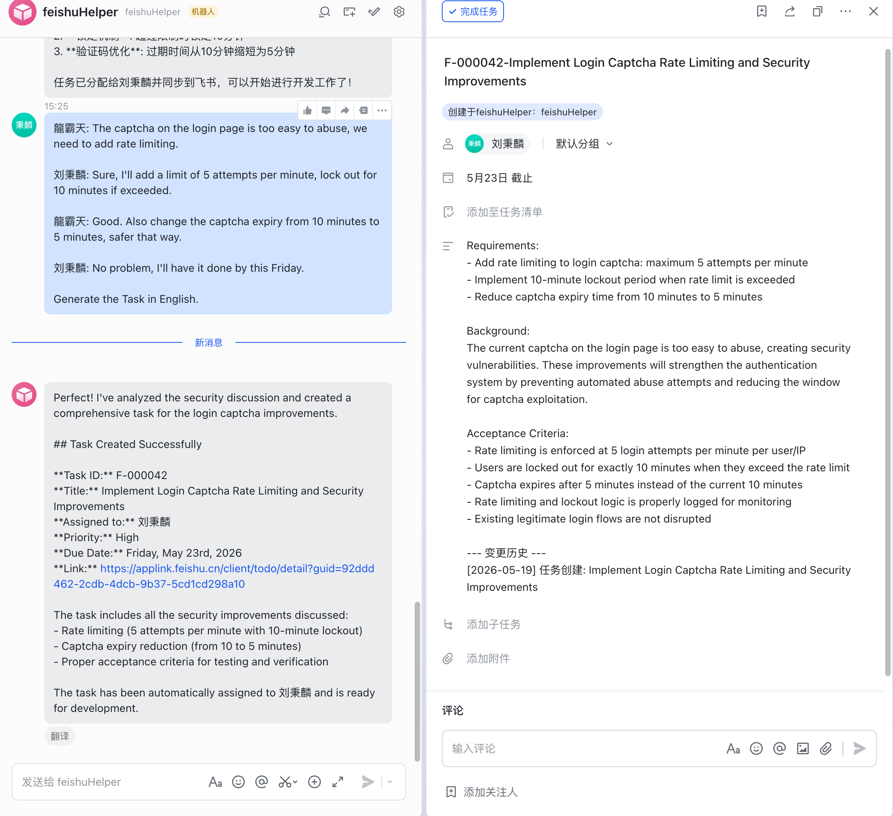
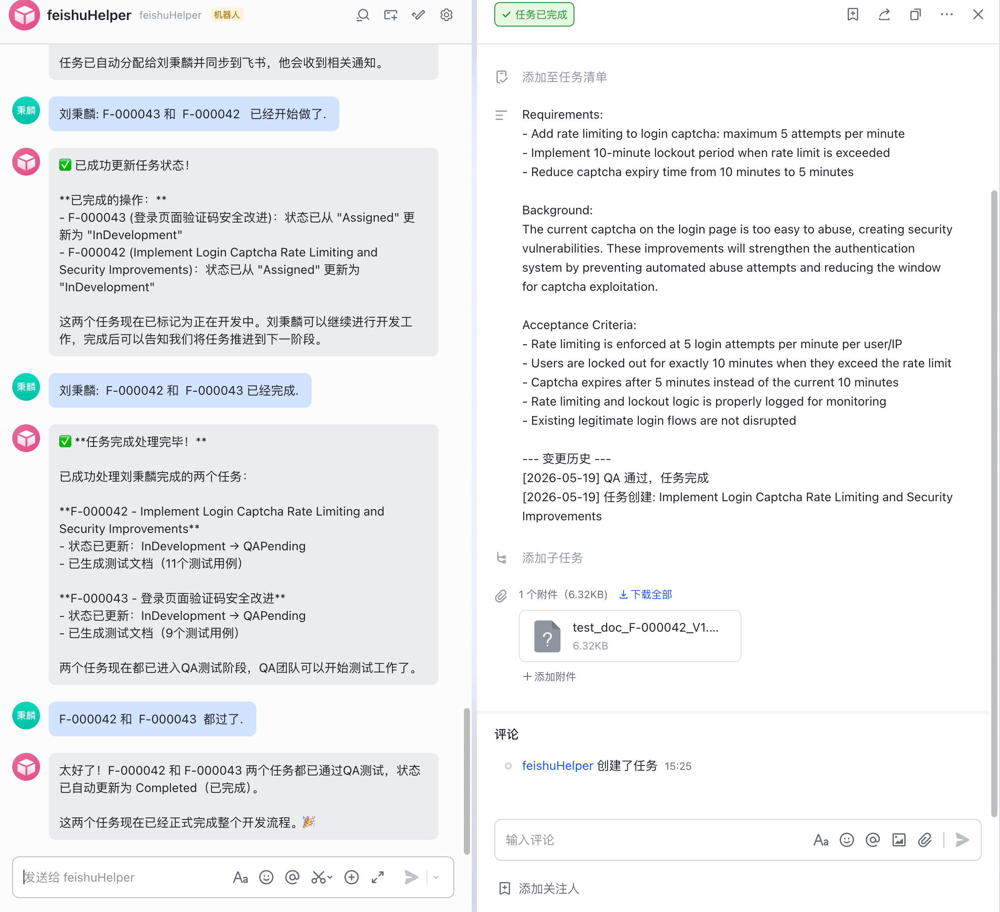

# Feishu Helper — System Architecture & Feature Guide

## About This Project

This project was independently designed and directed by **Dallas Liu (刘秉麟)**, with all development carried out entirely using AI coding tools (Kiro). From architecture design and technology selection to code implementation and testing — every line of code was AI-generated, with human responsibility limited to direction, requirements definition, and quality approval.

This is not simply a "let AI write code" project — it is itself an **AI Agent application**, demonstrating deep understanding of:

- **LLM vs Agent vs App**: LLM can only "think", Agent can "think + act" (tool calling), App is a complete product (entry point + persistence + business logic + Agent)
- **Tool-Calling Loop**: LLM doesn't answer in one shot — it loops: think → call tool → get result → think again → until done
- **Prompt Engineering**: Precisely controlling LLM behavior through system prompts (description format, merge rules, date resolution, tool usage priorities)
- **Agent + Traditional Backend**: Agent handles the decision layer; traditional backend handles persistence, state management, and messaging
- **Read-Time Sync vs Event Subscription**: When no webhook events are available, using "diff + LLM decision" to achieve data synchronization

This project proves a point: **understanding AI system architecture and principles matters more than writing code**. AI can write code, but it takes a human to design systems, define boundaries, and make architectural decisions.

---

## 1. Overview

Feishu Helper is an AI-powered workflow automation system for Feishu (Lark). It receives messages through a Feishu bot, uses an LLM (Claude) to understand user intent, automatically executes task management operations (create, assign, advance state, QA feedback, etc.), and syncs results to the Feishu task system.

**One-liner**: User speaks in Feishu → AI understands and executes → Feishu tasks are automatically created/updated/completed.

### Demo: Meeting → Task Creation → Completion

**Task Created from Meeting Discussion:**



**Task Completed after QA Pass:**



---

## 2. Core Features

| Feature | Description |
|---------|-------------|
| Meeting Analysis | Send meeting content, AI extracts action items and creates Feishu tasks |
| Task Creation | Say "create a task for me", AI creates Feishu task + local DB record |
| Task Assignment | Say "assign to Dallas", AI looks up employee, assigns task, syncs to Feishu |
| State Advancement | Say "started"/"done"/"QA passed", AI advances workflow state |
| QA Flow | Generate test docs, submit QA feedback, auto-revert or complete |
| Feishu Sync | Say "sync please", AI compares Feishu vs local data and updates |
| Code Verification | After code submission, AI compares against requirements (reference report) |
| LLM Tracing | All LLM interactions automatically traced via LangSmith for debugging and error analysis |

---

## 3. Tech Stack

- **Runtime**: Node.js + TypeScript
- **HTTP Framework**: Fastify
- **AI/LLM**: LangChain.js + Claude (Anthropic)
- **Feishu Integration**: @larksuiteoapi/node-sdk (REST API + WebSocket long connection)
- **Database**: PostgreSQL
- **Message Queue**: BullMQ + Redis
- **Testing**: Vitest

---

## 4. Complete Request Flow (Message to Response)

```
User sends message in Feishu
       │
       ▼
┌─────────────────┐
│ Feishu WebSocket│  Feishu platform pushes events via persistent connection
│  (Feishu SDK)   │
└────────┬────────┘
         │ im.message.receive_v1 event
         ▼
┌─────────────────┐
│   WsGateway     │  Bridges Feishu SDK event format → internal EventDispatcher format
│  (wsGateway.ts) │
└────────┬────────┘
         │ dispatch(feishuEvent)
         ▼
┌─────────────────┐
│ EventDispatcher │  Routes by event_type to corresponding handler
│(webhookGateway) │  Note: EventDispatcher is just a router class;
│                 │  actual entry is WsGateway, not HTTP Webhook
└────────┬────────┘
         │ im.message.receive_v1 → handleMessageEvent
         ▼
┌─────────────────┐
│ MessageHandler  │  Three-layer protection (sender_type + create_time + message_id dedup)
│(messageHandler) │  Parse message content → build AgentInput
└────────┬────────┘
         │ agentCore.processInput(input)
         ▼
┌─────────────────┐
│   AgentCore     │  LLM + tool-calling loop (max 10 iterations)
│  (agentCore.ts) │  Claude decides which tools to call → execute → feed results back → decide again
└────────┬────────┘
         │ Final text response
         ▼
┌─────────────────┐
│ Notification    │  Sends reply message via Feishu REST API
│   Service       │
└─────────────────┘
```

> **Note**: The `EventDispatcher` class in `webhookGateway.ts` is just an event router (register handlers + dispatch). It is NOT an HTTP Webhook entry point. The actual message entry is `WsGateway` (WebSocket long connection). The Fastify webhook routes in `webhookGateway.ts` are legacy from early design and currently unused.

---

## 5. Layer-by-Layer Explanation

### 5.1 Feishu Connection Layer (WsGateway)

**File**: `src/gateway/wsGateway.ts`

**Purpose**: Establishes a persistent WebSocket connection to Feishu and receives all push events.

**How it works**:
1. Uses `WSClient` from `@larksuiteoapi/node-sdk` with `appId` + `appSecret`
2. Registers event handlers: `im.message.receive_v1` (user messages) and `card.action.trigger` (card buttons)
3. Feishu SDK handles: connection establishment, auto-reconnect, event decryption, signature verification
4. On event received, calls `bridgeEvent()` to convert SDK's flat data format to internal `FeishuEvent` format
5. Forwards to `EventDispatcher` for routing

**Why long connection instead of Webhook**:
- No public URL needed (dev-friendly)
- No ngrok/cloudflared required
- SDK auto-reconnects, good stability

---

### 5.2 Message Processing Layer (MessageHandler)

**File**: `src/integration/messageHandler.ts`

**Purpose**: Receives routed events, applies security filtering, then hands off to AgentCore.

**Three-layer protection**:
1. **sender_type filter**: Ignores messages sent by the bot itself (prevents "receive → reply → receive reply" infinite loop)
2. **create_time filter**: Discards messages older than 5 minutes (prevents stale message replay after reconnection)
3. **message_id dedup**: In-memory Set tracks processed message IDs (prevents same message pushed twice due to network jitter)

**Processing flow**:
1. Extract `sender`, `message`, `chat_id`
2. Apply three-layer protection
3. Parse message content (Feishu sends JSON-encoded text)
4. Build `AgentInput` (sessionId = message_id, ensuring independent context per message)
5. Call `agentCore.processInput(input)`
6. Send reply back to Feishu via `NotificationService`

---

### 5.3 AI Agent Core (AgentCore)

**Files**: `src/agent/agentCore.ts` + `src/agent/agentCoreToolBoxRegister.ts`

**Purpose**: The system's "brain". Receives user intent, makes decisions via LLM, invokes tools to execute operations.

**Core Mechanism — Tool-Calling Loop**:

```
User message → [System Prompt + History + User Message] → Send to Claude
                                                              │
                                                              ▼
                                                    Claude returns response
                                                              │
                                                ┌─────────────┴─────────────┐
                                                │                           │
                                          has tool_calls              plain text reply
                                                │                           │
                                                ▼                           ▼
                                          Execute each tool            Return to user
                                          (call DB/Feishu API)
                                                │
                                                ▼
                                          Feed tool results back to Claude
                                                │
                                                ▼
                                          Claude decides again...
                                          (loop, max 10 iterations)
```

**System Prompt includes**:
- Usage rules and priorities for all 10 tools
- Complete database schema (so LLM can write SQL queries)
- Task description format specification (Requirements/Background/Acceptance Criteria)
- Current date (dynamically injected, for resolving "this Wednesday" etc.)
- Workflow rules (when to use which tool)

**10 Tools**:

| # | Tool Name | Purpose |
|---|-----------|---------|
| 1 | analyze_meeting | Analyze meeting content, extract action items, save to meetings table |
| 2 | query_sql | General-purpose read-only SQL query (tasks, employees, meetings, etc.) |
| 3 | create_feishu_task | Create task (write DB + call Feishu API + auto-assign) |
| 4 | update_task | Update task fields (title/description/priority/due_date) |
| 5 | assign_task | Assign task to person (write DB + Feishu addMembers) |
| 6 | advance_task | Advance task state (via state machine) |
| 7 | verify_code | AI code verification (generate report, no state change) |
| 8 | generate_test_doc | Generate QA test document (save DB + Feishu attachment) |
| 9 | submit_qa_feedback | Submit QA result (save feedback + auto-advance state) |
| 10 | sync_task | Compare Feishu vs local data differences (read-only, returns diff) |

---

### 5.4 Workflow State Machine

**File**: `src/workflow/stateMachine.ts`

**Task Lifecycle**:

```
Created → Assigned → InDevelopment → QAPending → QAPassed → Completed
                          ↑                         │
                          └─── QAFailed ←───────────┘
```

**Transition Rules**:
- `Created → Assigned`: Task assigned to someone
- `Assigned → InDevelopment`: Developer confirms acceptance
- `InDevelopment → QAPending`: Development complete, enters QA
- `QAPending → QAPassed → Completed`: QA passed, task done
- `QAPending → QAFailed → InDevelopment`: QA failed, back to development

**Each state transition**:
- Validates transition legality (illegal transitions rejected immediately)
- Writes to `workflow_logs` table (audit trail)
- Uses optimistic locking to prevent concurrent conflicts

---

### 5.5 Error Handling & Retry (Errors + Retry)

**Files**: `src/utils/errors.ts` + `src/utils/retry.ts`

**Error Classification**:

| Category | Retryable | Scenario |
|----------|-----------|----------|
| feishu_api | ✅ Up to 3 times | Feishu API timeout, rate limiting |
| llm_service | ✅ Up to 2 times | Claude API timeout, service unavailable |
| state_transition | ❌ | Invalid state transition (e.g. Created → Completed) |
| validation | ❌ | Parameter errors (empty title, invalid ID) |
| business_logic | ❌ | Business rule violations (task not found, duplicate assignment) |

**Retry Strategy**: Exponential backoff (1s → 2s → 4s), doubling wait time each attempt to avoid overwhelming external APIs.

**Error Propagation Path**:
```
Tool function throws AppError
       │
       ▼
AgentCore catches → returns error message as tool result to Claude
       │
       ▼
Claude sees error → decides whether to retry or inform user
       │
       ▼
Final reply to user (success result or friendly error message)
```

---

### 5.6 Feishu Data Sync (FeishuSync)

**File**: `src/services/feishuSync.ts`

**Design Philosophy**: Pure read-only "scout" — writes nothing.

**Flow**:
1. User says "I changed something in Feishu, please sync"
2. `sync_task` tool calls `FeishuSyncService.diff(taskId)`
3. Pulls latest task state from Feishu API
4. Queries local DB for comparison
5. Returns diff list to LLM
6. LLM decides to call `update_task` or `assign_task` based on diffs

**Compared fields**: title, description, due_date, assignee_id
**Not synced**: state (state can only change via state machine)

---

### 5.7 Description History Management (syncDescriptionToFeishu)

**File**: `src/agent/agentCoreToolBoxRegister.ts` (internal helper)

**Feishu Task Description Format**:
```
需求:
- xxx
- xxx

背景:
xxx

验收标准:
- xxx
- xxx

--- 变更历史 ---
[2026-05-18] QA failed (implementation issue): TTL needs to be 10 hours
[2026-05-18] Task created: Implement captcha security optimization
```

**Rules**:
- LLM only writes the content section above (Requirements/Background/Acceptance Criteria)
- `--- 变更历史 ---` is managed automatically by code
- Each operation (create, assign, QA feedback, etc.) auto-appends a history line
- History stored in DB's `description_history` JSONB field

---

## 6. Database Design

| Table | Purpose |
|-------|---------|
| tasks | Main task table (title, description, state, assignee, feishu_task_id) |
| meetings | Meeting records (raw content + AI analysis results) |
| task_meetings | Task-meeting many-to-many junction |
| employees | Team roster (name → open_id mapping) |
| workflow_logs | State transition audit log |
| task_assignments | Assignment records (supports reassignment history) |
| verification_reports | AI code verification reports |
| qa_feedbacks | QA feedback records |
| documents | Generated test documents |

---

## 7. Startup Sequence

```typescript
main()
  ├── getConfig()           // Read environment variables
  ├── getPool()             // Initialize PostgreSQL connection pool
  ├── initQueues()          // Initialize BullMQ queues
  ├── initWorkers()         // Start queue Workers
  ├── buildApp()            // Build Fastify HTTP service (/health endpoint)
  ├── app.listen()          // Start HTTP server
  ├── AgentCore.initialize()// Initialize LLM + register 10 tools
  ├── registerMessageHandler()  // Register event handlers
  └── WsGateway.start()    // Establish Feishu WebSocket long connection
```

**Graceful Shutdown** (on SIGTERM/SIGINT):
```
Close WebSocket → Close HTTP → Close queues → Close database pool
```

---

## 8. Key Design Decisions

1. **Feishu MCP cannot be called directly in code** — All Feishu operations use `node-sdk` Client
2. **AgentCore only orchestrates** — Tool functions call Service layer, never touch DB directly
3. **State can only change via state machine** — sync doesn't sync state, Feishu completion doesn't affect local state
4. **Description history is code-managed** — LLM doesn't write history, only content
5. **sync_task is a scout tool** — Only reports differences, LLM decides how to handle them
6. **Each message gets independent session** — Prevents stale failure context from poisoning subsequent messages
7. **Long connection mode** — No public URL needed for development

---

## 9. Source File Reference (in call-order)

Files listed in the order a message flows through the system, from entry to response.

---

### Layer 1: Startup & Entry

#### `src/index.ts` — Application Entry Point
The `main()` function. Initializes all components in order: read config → connect DB → start queues → start HTTP → initialize AgentCore → register message handlers → establish Feishu WebSocket. Also handles graceful shutdown (closes resources in reverse order on SIGTERM/SIGINT).

#### `src/app.ts` — Fastify HTTP Application
Builds the Fastify instance, registers `/health` health check endpoint. HTTP service is mainly for ops monitoring; actual messages don't flow through HTTP.

---

### Layer 2: Configuration

#### `src/config/index.ts` — Application Configuration
Reads all config from environment variables (Feishu App ID/Secret, LLM API Key, DB connection, Redis connection, etc.). Validates required fields exist at startup. All modules access config via `getConfig()`.

#### `src/config/database.ts` — Database Connection Pool
Manages the PostgreSQL connection pool (`pg` library's Pool). Provides `getPool()` (get/create pool) and `closePool()` (close pool).

---

### Layer 3: Message Reception

#### `src/gateway/wsGateway.ts` — WebSocket Long Connection Gateway (actual entry)
Uses Feishu SDK's `WSClient` to establish a WebSocket long connection. Converts SDK's flat event format to internal `FeishuEvent` format, then hands to `EventDispatcher` for routing. This is the only entry point for messages into the system.

#### `src/gateway/webhookGateway.ts` — Event Router + Webhook (legacy)
Defines the `EventDispatcher` class (register handlers + dispatch by event_type) and `FeishuEvent` type. `EventDispatcher` is used by both `WsGateway` and `MessageHandler`. The Fastify webhook routes in this file are legacy from early design, currently unused (long connection mode doesn't need a public webhook).

---

### Layer 4: Message Processing

#### `src/integration/messageHandler.ts` — Message Handler
Bridge connecting EventDispatcher → AgentCore → NotificationService. Registers handlers for `im.message.receive_v1` and `card.action.trigger`. Responsible for three-layer protection (anti-loop, anti-replay, anti-duplicate), parsing message content, building AgentInput, calling AgentCore, and sending replies.

---

### Layer 5: AI Agent

#### `src/agent/agentCore.ts` — Agent Core
The system's "brain". Manages LLM instance, session context, tool registration. Core method `processInput()`: build message list → send to Claude → if Claude wants to call tools, execute them → feed results back → loop until Claude gives plain text reply (max 10 rounds). Dynamically injects current date into system prompt.

#### `src/agent/agentCoreToolBoxRegister.ts` — Tool Registration
Defines and exports 10 `DynamicStructuredTool` instances (LangChain tools). Each tool is a standalone function that accepts parameters, executes operations (calls Service layer / Feishu API / DB), and returns a result string. Also contains the `syncDescriptionToFeishu` helper (manages Feishu description + history).

---

### Layer 6: Service Layer (Business Logic)

#### `src/services/meetingAnalyzer.ts` — Meeting Analyzer
Calls LLM to analyze meeting minutes, returns structured results (summary, action items, decisions, discussion points). Uses Zod schema to force LLM output into fixed format. Supports long content chunking (split → analyze each → merge/deduplicate). Called by `analyze_meeting` tool.

#### `src/services/taskManager.ts` — Task Manager
Core Service for task CRUD. `createTask()`: write DB to get display_id → call Feishu API to create task → update DB with feishu_task_id. `splitTask()`: split into subtasks. `updateTaskDescription()`: update description + preserve history. `updateTaskState()`: call state machine for transitions. Called by `create_feishu_task`, `update_task`, `advance_task`, `submit_qa_feedback` and other tools.

#### `src/services/taskAssignment.ts` — Task Assignment Management
Manages `task_assignments` table. `assignTask()`: create assignment record, mark old record as reassigned. `confirmAssignment()`: developer confirms acceptance. `completeAssignment()`: mark assignment as completed when task is done. Called by `assign_task` tool.

#### `src/services/feishuSync.ts` — Feishu Data Sync
Pure read-only Service. `diff(taskId)`: pull Feishu API → query DB → return diff list. Writes nothing. Compared fields: title, description, due_date, assignee_id. Strips history section from description before comparing. Called by `sync_task` tool.

#### `src/services/codeVerifier.ts` — Code Verifier
Calls LLM to compare code changes against task description, generates verification report (matchScore, discrepancies, recommendations). Report persisted to `verification_reports` table. Does not advance state (report-only). Called by `verify_code` tool.

#### `src/services/docGenerator.ts` — Test Document Generator
Calls LLM to generate test cases based on task description (positive, negative, boundary conditions). Each case includes preconditions, steps, expected results. Document saved to `documents` table and uploaded as Feishu task attachment. Called by `generate_test_doc` tool.

#### `src/services/qaFeedback.ts` — QA Feedback Processing
Manages `qa_feedbacks` table. Records QA results (passed/failed), failure type, detailed feedback. Advances state based on result (passed → Completed, failed → InDevelopment). Used internally by `submit_qa_feedback` tool logic.

#### `src/services/notification.ts` — Notification Service
Sends messages via Feishu REST API (`im.v1.message.create`). On send failure, enqueues to BullMQ notification queue for retry. Called by `messageHandler` as the final step to send AgentCore's reply back to Feishu.

---

### Layer 7: Workflow Engine

#### `src/workflow/stateMachine.ts` — State Machine
Defines valid state transition table. `validateTransition(from, to)`: checks if transition is legal. `transition(taskId, toState, context)`: executes transition (optimistic lock + writes workflow_logs). Illegal transitions are rejected immediately without modifying any data.

#### `src/workflow/workflowEngine.ts` — Workflow Engine
High-level workflow operations. `startWorkflow()`: batch-create tasks from meeting analysis results. `advanceWorkflow()`: advance workflow based on events. `revertWorkflow()`: revert workflow. Internally calls stateMachine for actual transitions.

---

### Layer 8: Infrastructure

#### `src/utils/db.ts` — Database Utility Functions
Wraps PostgreSQL operations: `query()`, `queryOne()`, `insert()`, `update()`, `remove()`, `withTransaction()`. All Service layer code uses these functions instead of directly accessing the pg Pool.

#### `src/utils/errors.ts` — Unified Error Framework
Defines `AppError` class and 5 error categories (feishu_api, llm_service, state_transition, validation, business_logic). Each category has different retry strategies. Provides static factory methods for convenient construction.

#### `src/utils/retry.ts` — Exponential Backoff Retry
`withRetry(fn)` function: executes fn, if it throws and the error category allows retry, waits (1s → 2s → 4s) then retries, up to N times. Non-retryable errors are thrown immediately.

#### `src/queue/index.ts` — BullMQ Message Queue
Defines 5 queues (meeting-analysis, task-creation, code-verification, doc-generation, notification). Provides `addXxxJob()` functions to enqueue, Worker processors dequeue and execute. In the current MVP, most operations are synchronous; queues are mainly used for notification retry.

---

### Layer 9: Type Definitions

#### `src/models/task.ts` — Task Types
Defines `Task`, `TaskState`, `TaskCreateParams`, `SubTask`, `DescriptionUpdate` and other interfaces.

#### `src/models/meeting.ts` — Meeting Types
Defines `Meeting`, `MeetingAnalysis`, `ActionItem`, `MeetingSummary`, `Decision`, `DiscussionPoint` and other interfaces.

#### `src/models/workflow.ts` — Workflow Types
Defines `WorkflowEvent`, `WorkflowStatus`, `StateTransition` and other interfaces.

#### `src/models/verification.ts` — Verification Types
Defines `VerificationReport`, `CodeContext`, `StoredVerificationReport` and other interfaces.

#### `src/models/document.ts` — Document Types
Defines `TestDocument`, `TestCase`, `TestStep` and other interfaces.

#### `src/models/index.ts` — Unified Export
Re-exports all model files for convenient `import { Task, Meeting } from '../models/index.js'`.

---

### Other Files

#### `migrations/schema.sql` — Database Schema
Complete table creation SQL (9 tables + indexes + sequence). Execute this file to set up a fresh database from scratch.

#### `.env` — Environment Variables
All configuration values (Feishu credentials, LLM API Key, DB connection, Redis connection, etc.). Not committed to Git.

#### `.env.example` — Environment Variables Template
Template for `.env` with all keys documented and values left empty. Committed to Git for reference.
