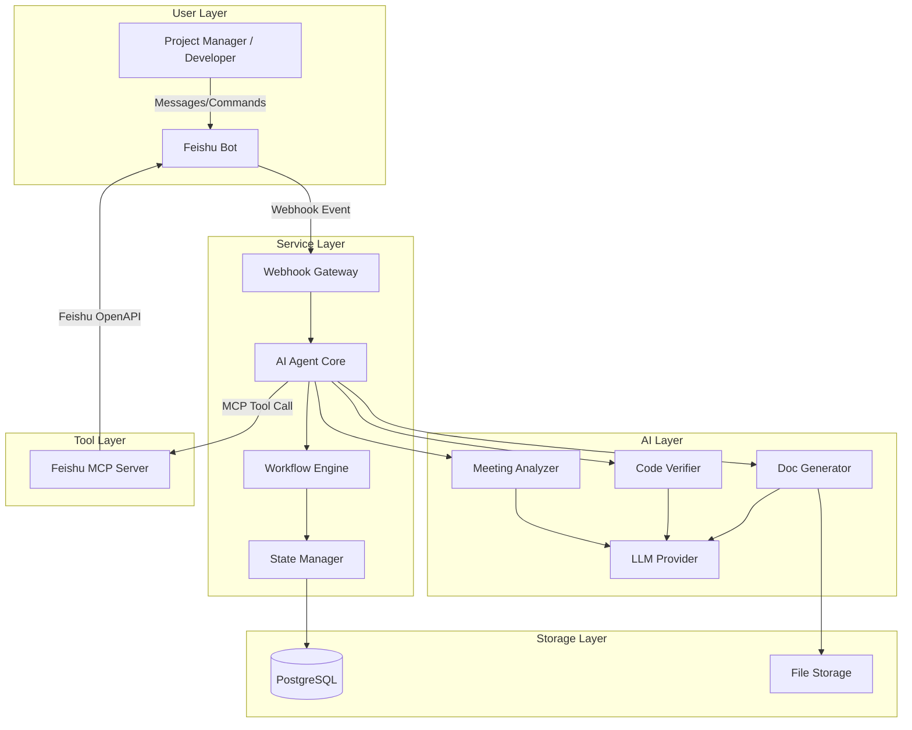
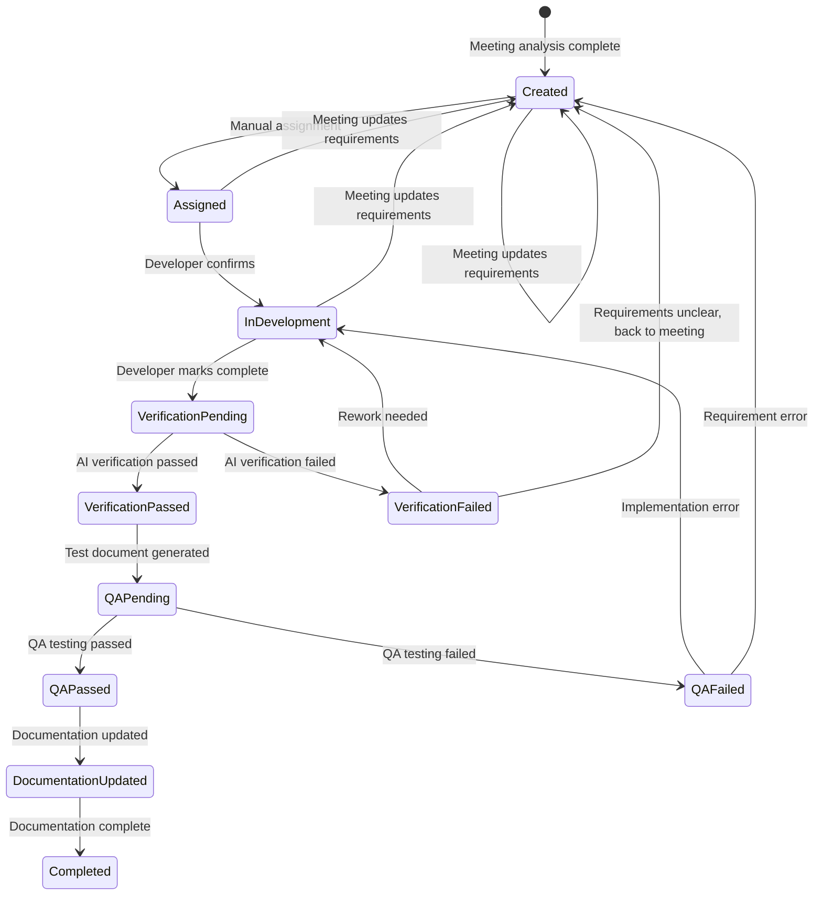

# Design Document: Feishu Helper

## Overview

Feishu Helper is a backend service built on AI Agent + Feishu MCP that automatically transforms Feishu meeting minutes into executable development tasks, spanning the entire development lifecycle. The system uses an event-driven architecture with a Feishu Bot as the user interaction entry point, an AI Agent (LLM) as the core decision-making brain, and the official Feishu MCP (`@larksuiteoapi/lark-mcp`) as the tool layer for operating the Feishu platform.

**Core Flow**: User uploads meeting content via Feishu Bot → AI Agent analyzes and makes decisions → Executes Feishu operations via Feishu MCP (create tasks, update docs, etc.) → Human confirms/assigns via Feishu messages → Workflow progresses in a loop.

**Key Design Decisions**:
1. **Use Official Feishu MCP**: Adopt `@larksuiteoapi/lark-mcp` as the unified access layer for Feishu APIs, avoiding direct REST API wrapping
2. **State Machine Driven**: Each task is managed through a finite state machine for its lifecycle, ensuring traceability and reversibility
3. **Human-AI Collaboration**: AI handles analysis and generation, humans handle confirmation and assignment, interaction via Feishu message notifications

## Architecture

### System Architecture Diagram



### Workflow State Machine



### Technology Stack

| Layer | Technology | Rationale |
|-------|-----------|-----------|
| Runtime | Node.js (TypeScript) | Consistent with Feishu MCP ecosystem, async I/O suits event-driven architecture |
| AI Agent Framework | LangChain.js | Mature Agent framework, supports Tool Calling and MCP integration |
| Feishu Integration | @larksuiteoapi/lark-mcp | Official Feishu MCP, wraps complete OpenAPI |
| LLM Provider | OpenAI GPT-4 / Claude | Supports Function Calling, strong analysis capabilities |
| Database | PostgreSQL | Supports JSONB for flexible task metadata storage |
| Message Queue | BullMQ (Redis) | Handles async workflow tasks, supports retry and delay |
| Web Framework | Fastify | High performance, suitable for Webhook handling |

## Components and Interfaces

### 1. Webhook Gateway

Responsible for receiving Feishu Bot event callbacks, verifying signatures, and dispatching events.

```typescript
interface WebhookGateway {
  // Receive Feishu event callback
  handleEvent(event: FeishuEvent): Promise<void>;
  // Verify request signature
  verifySignature(headers: Record<string, string>, body: string): boolean;
  // URL verification (required by Feishu)
  handleChallenge(challenge: string): { challenge: string };
}

interface FeishuEvent {
  schema: string;
  header: {
    event_id: string;
    event_type: string;
    create_time: string;
    token: string;
    app_id: string;
  };
  event: {
    message?: MessageEvent;
    action?: CardActionEvent;
  };
}

interface MessageEvent {
  message_id: string;
  chat_id: string;
  chat_type: string;
  content: string;
  sender: { sender_id: { user_id: string } };
}
```

### 2. AI Agent Core

Core Agent module that coordinates LLM calls and tool usage.

```typescript
interface AgentCore {
  // Process user input, decide next action
  processInput(input: AgentInput): Promise<AgentOutput>;
  // Execute MCP tool call
  callTool(toolName: string, params: Record<string, unknown>): Promise<ToolResult>;
  // Get conversation context
  getContext(sessionId: string): Promise<ConversationContext>;
}

interface AgentInput {
  sessionId: string;
  userId: string;
  messageType: 'text' | 'file' | 'command' | 'callback';
  content: string;
  metadata?: Record<string, unknown>;
}

interface AgentOutput {
  actions: AgentAction[];
  response?: string;
  nextState?: TaskState;
}

type AgentAction =
  | { type: 'send_message'; chatId: string; content: string }
  | { type: 'create_task'; task: TaskCreateParams }
  | { type: 'update_task'; taskId: string; updates: Partial<Task> }
  | { type: 'generate_document'; docType: DocType; context: DocContext }
  | { type: 'verify_code'; taskId: string; codeRef: string };
```

### 3. Meeting Analyzer

Meeting minutes analysis module that extracts structured information.

```typescript
interface MeetingAnalyzer {
  // Analyze meeting minutes content
  analyze(content: string): Promise<MeetingAnalysis>;
  // Extract action items
  extractActionItems(content: string): Promise<ActionItem[]>;
  // Generate structured summary
  generateSummary(content: string): Promise<MeetingSummary>;
}

interface MeetingAnalysis {
  summary: MeetingSummary;
  actionItems: ActionItem[];
  decisions: Decision[];
  discussionPoints: DiscussionPoint[];
}

interface MeetingSummary {
  title: string;
  date: string;
  participants: string[];
  keyPoints: string[];
  overallSummary: string;
}

interface ActionItem {
  id: string;
  description: string;
  context: string;
  priority: 'high' | 'medium' | 'low';
  suggestedAssignee?: string;
  dependencies: string[];
  acceptanceCriteria: string[];
}
```

### 4. Task Manager

Task management module that operates tasks via Feishu MCP.

```typescript
interface TaskManager {
  // Create task
  createTask(params: TaskCreateParams): Promise<Task>;
  // Split into subtasks
  splitTask(taskId: string, subtasks: SubTaskParams[]): Promise<SubTask[]>;
  // Update task description
  updateTaskDescription(taskId: string, description: string, reason: string): Promise<Task>;
  // Update task state
  updateTaskState(taskId: string, newState: TaskState, trigger: string): Promise<Task>;
  // Get task details
  getTask(taskId: string): Promise<Task>;
  // List project tasks
  listTasks(filter: TaskFilter): Promise<Task[]>;
}

interface TaskCreateParams {
  title: string;
  description: string;
  acceptanceCriteria: string[];
  dependencies: string[];
  priority: 'high' | 'medium' | 'low';
  sourceActionItemId: string;
  meetingId: string;
}

interface SubTaskParams {
  title: string;
  description: string;
  scope: string;
  estimatedEffort?: string;
}
```

### 5. Code Verifier

Code verification module that compares implementation against requirements.

```typescript
interface CodeVerifier {
  // Verify if code matches task description
  verify(taskId: string, codeContext: CodeContext): Promise<VerificationReport>;
}

interface CodeContext {
  taskDescription: string;
  acceptanceCriteria: string[];
  codeChanges: string;  // diff or code snippet
  commitMessage?: string;
}

interface VerificationReport {
  taskId: string;
  status: 'passed' | 'failed' | 'ambiguous';
  matchScore: number;  // 0-100
  analysis: {
    matchedCriteria: string[];
    unmatchedCriteria: string[];
    discrepancies: Discrepancy[];
    recommendations: string[];
  };
  generatedAt: string;
}

// Note: Regardless of AI verification status, the task always advances to
// VerificationPassed (QA stage). The AI score and discrepancies are surfaced
// in the workflow event payload for QA reference. Humans make the final call.

interface Discrepancy {
  criterion: string;
  expected: string;
  actual: string;
  severity: 'critical' | 'major' | 'minor';
}
```

### 6. Doc Generator

Document generation module.

```typescript
interface DocGenerator {
  // Generate test document
  generateTestDocument(task: Task): Promise<TestDocument>;
  // Update MD document
  updateMDDocument(docId: string, content: DocUpdateContent): Promise<MDDocument>;
  // Compile user manual
  compileUserManual(docIds: string[]): Promise<UserManual>;
}

interface TestDocument {
  taskId: string;
  testCases: TestCase[];
  generatedAt: string;
}

interface TestCase {
  id: string;
  title: string;
  type: 'positive' | 'negative' | 'boundary';
  preconditions: string[];
  steps: TestStep[];
  expectedResult: string;
}

interface TestStep {
  order: number;
  action: string;
  expectedOutcome?: string;
}

interface MDDocument {
  id: string;
  title: string;
  sections: DocSection[];
  version: string;
  lastUpdated: string;
}

interface DocSection {
  heading: string;
  level: number;
  content: string;
  subsections?: DocSection[];
}
```

### 7. Workflow Engine

Workflow engine that orchestrates task lifecycle.

```typescript
interface WorkflowEngine {
  // Start workflow
  startWorkflow(meetingAnalysis: MeetingAnalysis): Promise<string>;
  // Advance workflow
  advanceWorkflow(taskId: string, event: WorkflowEvent): Promise<void>;
  // Revert workflow
  revertWorkflow(taskId: string, targetState: TaskState, reason: string): Promise<void>;
  // Get workflow status
  getWorkflowStatus(taskId: string): Promise<WorkflowStatus>;
}

interface WorkflowEvent {
  type: 'assignment' | 'dev_complete' | 'verification_result' | 'qa_result' | 'doc_updated' | 'meeting_update';
  payload: Record<string, unknown>;
  actor: string;
  timestamp: string;
}

interface WorkflowStatus {
  taskId: string;
  currentState: TaskState;
  history: StateTransition[];
  retryCount: number;
  failureContext?: string;
}

interface StateTransition {
  fromState: TaskState;
  toState: TaskState;
  trigger: string;
  actor: string;
  timestamp: string;
  reason?: string;
}
```

### 8. State Manager

State management module that persists task states and transition history.

```typescript
interface StateManager {
  // Get current state
  getCurrentState(taskId: string): Promise<TaskState>;
  // Execute state transition
  transition(taskId: string, toState: TaskState, context: TransitionContext): Promise<boolean>;
  // Validate if transition is legal
  validateTransition(fromState: TaskState, toState: TaskState): boolean;
  // Get transition history
  getTransitionHistory(taskId: string): Promise<StateTransition[]>;
  // Get retry count
  getRetryCount(taskId: string): Promise<number>;
}

type TaskState =
  | 'Created'
  | 'Assigned'
  | 'InDevelopment'
  | 'VerificationPending'
  | 'VerificationPassed'
  | 'VerificationFailed'
  | 'QAPending'
  | 'QAPassed'
  | 'QAFailed'
  | 'DocumentationUpdated'
  | 'Completed';

interface TransitionContext {
  trigger: string;
  actor: string;
  reason?: string;
  metadata?: Record<string, unknown>;
}
```

## Data Models

### Core Data Models

```typescript
// Task entity
interface Task {
  id: string;
  title: string;
  description: string;
  acceptanceCriteria: string[];
  dependencies: string[];
  priority: 'high' | 'medium' | 'low';
  state: TaskState;
  assignee?: string;
  parentTaskId?: string;  // Subtask association
  meetingId: string;
  sourceActionItemId: string;
  feishuTaskId?: string;  // Feishu task ID
  retryCount: number;
  failureContext?: string;
  descriptionHistory: DescriptionUpdate[];
  createdAt: string;
  updatedAt: string;
}

interface DescriptionUpdate {
  previousDescription: string;
  newDescription: string;
  reason: string;
  updatedBy: string;
  updatedAt: string;
}

// Meeting record
interface Meeting {
  id: string;
  title: string;
  date: string;
  feishuDocId: string;  // Feishu document ID
  rawContent: string;
  analysis: MeetingAnalysis;
  createdTasks: string[];  // Associated task IDs
  createdAt: string;
}

// Task assignment relationship
interface TaskAssignment {
  id: string;
  taskId: string;
  assigneeId: string;
  assigneeName: string;
  assignedBy: string;
  assignedAt: string;
  status: 'active' | 'reassigned' | 'completed';
}

// Verification report
interface StoredVerificationReport {
  id: string;
  taskId: string;
  report: VerificationReport;
  codeContext: CodeContext;
  createdAt: string;
}

// Workflow log
interface WorkflowLog {
  id: string;
  taskId: string;
  fromState: TaskState;
  toState: TaskState;
  trigger: string;
  actor: string;
  reason?: string;
  metadata?: Record<string, unknown>;
  timestamp: string;
}

// QA feedback
interface QAFeedback {
  id: string;
  taskId: string;
  result: 'passed' | 'failed';
  failureType?: 'requirement_error' | 'implementation_error';
  details: string;
  testCaseResults: TestCaseResult[];
  reportedBy: string;
  reportedAt: string;
}

interface TestCaseResult {
  testCaseId: string;
  status: 'passed' | 'failed' | 'skipped';
  actualResult?: string;
  notes?: string;
}
```

### Database Schema

```sql
-- Tasks table
CREATE TABLE tasks (
  id UUID PRIMARY KEY DEFAULT gen_random_uuid(),
  title VARCHAR(500) NOT NULL,
  description TEXT NOT NULL,
  acceptance_criteria JSONB NOT NULL DEFAULT '[]',
  dependencies JSONB NOT NULL DEFAULT '[]',
  priority VARCHAR(10) NOT NULL DEFAULT 'medium',
  state VARCHAR(30) NOT NULL DEFAULT 'Created',
  assignee_id VARCHAR(100),
  parent_task_id UUID REFERENCES tasks(id),
  meeting_id UUID NOT NULL REFERENCES meetings(id),
  source_action_item_id VARCHAR(100),
  feishu_task_id VARCHAR(100),
  retry_count INTEGER NOT NULL DEFAULT 0,
  failure_context TEXT,
  description_history JSONB NOT NULL DEFAULT '[]',
  created_at TIMESTAMPTZ NOT NULL DEFAULT NOW(),
  updated_at TIMESTAMPTZ NOT NULL DEFAULT NOW()
);

-- Meetings table
CREATE TABLE meetings (
  id UUID PRIMARY KEY DEFAULT gen_random_uuid(),
  title VARCHAR(500),
  meeting_date TIMESTAMPTZ,
  feishu_doc_id VARCHAR(100) NOT NULL,
  raw_content TEXT,
  analysis JSONB,
  created_at TIMESTAMPTZ NOT NULL DEFAULT NOW()
);

-- Workflow logs table
CREATE TABLE workflow_logs (
  id UUID PRIMARY KEY DEFAULT gen_random_uuid(),
  task_id UUID NOT NULL REFERENCES tasks(id),
  from_state VARCHAR(30) NOT NULL,
  to_state VARCHAR(30) NOT NULL,
  trigger VARCHAR(100) NOT NULL,
  actor VARCHAR(100) NOT NULL,
  reason TEXT,
  metadata JSONB,
  timestamp TIMESTAMPTZ NOT NULL DEFAULT NOW()
);

-- Task assignments table
CREATE TABLE task_assignments (
  id UUID PRIMARY KEY DEFAULT gen_random_uuid(),
  task_id UUID NOT NULL REFERENCES tasks(id),
  assignee_id VARCHAR(100) NOT NULL,
  assignee_name VARCHAR(200) NOT NULL,
  assigned_by VARCHAR(100) NOT NULL,
  assigned_at TIMESTAMPTZ NOT NULL DEFAULT NOW(),
  status VARCHAR(20) NOT NULL DEFAULT 'active'
);

-- Verification reports table
CREATE TABLE verification_reports (
  id UUID PRIMARY KEY DEFAULT gen_random_uuid(),
  task_id UUID NOT NULL REFERENCES tasks(id),
  report JSONB NOT NULL,
  code_context JSONB NOT NULL,
  created_at TIMESTAMPTZ NOT NULL DEFAULT NOW()
);

-- QA feedbacks table
CREATE TABLE qa_feedbacks (
  id UUID PRIMARY KEY DEFAULT gen_random_uuid(),
  task_id UUID NOT NULL REFERENCES tasks(id),
  result VARCHAR(10) NOT NULL,
  failure_type VARCHAR(30),
  details TEXT,
  test_case_results JSONB NOT NULL DEFAULT '[]',
  reported_by VARCHAR(100) NOT NULL,
  reported_at TIMESTAMPTZ NOT NULL DEFAULT NOW()
);

-- Documents table
CREATE TABLE documents (
  id UUID PRIMARY KEY DEFAULT gen_random_uuid(),
  title VARCHAR(500) NOT NULL,
  doc_type VARCHAR(30) NOT NULL, -- 'test_doc', 'md_doc', 'user_manual'
  content TEXT,
  sections JSONB,
  version VARCHAR(20) NOT NULL DEFAULT '1.0.0',
  related_task_id UUID REFERENCES tasks(id),
  feishu_doc_id VARCHAR(100),
  created_at TIMESTAMPTZ NOT NULL DEFAULT NOW(),
  updated_at TIMESTAMPTZ NOT NULL DEFAULT NOW()
);
```

## Correctness Properties

*A property is a characteristic or behavior that should hold true across all valid executions of a system—essentially, a formal statement about what the system should do. Properties serve as the bridge between human-readable specifications and machine-verifiable correctness guarantees.*

### Property 1: Meeting Analysis Completeness

*For any* meeting content string of any length (including very long content), the Meeting Analyzer SHALL produce a structured output that contains non-empty key decisions, action items, and discussion points fields, and the combined content of these fields SHALL reference all substantive content from the input without truncation.

**Validates: Requirements 1.2, 1.3**

### Property 2: Task Creation Completeness

*For any* set of action items produced by the Meeting Analyzer, the Task Manager SHALL create a corresponding task for each action item, and each task's description SHALL contain context, acceptance criteria, and dependencies fields that are non-empty and derived from the source action item.

**Validates: Requirements 2.1, 2.3**

### Property 3: Task Splitting Scope Boundaries

*For any* complex task that is split into subtasks, the union of all subtask scopes SHALL cover the parent task's scope, and no two subtasks SHALL have overlapping scope descriptions (i.e., each subtask addresses a distinct aspect of the parent task).

**Validates: Requirements 2.2**

### Property 4: Task Description History Preservation

*For any* sequence of N description updates applied to a task, the task's description history SHALL contain exactly N entries, each with the previous description, new description, modification reason, and timestamp, in chronological order.

**Validates: Requirements 2.5**

### Property 5: Assignment Mapping Consistency

*For any* sequence of task assignments, the system SHALL maintain a mapping where every active assignment has a valid task-developer pair, and querying the mapping for any assigned task SHALL return the correct current assignee.

**Validates: Requirements 3.1, 3.3**

### Property 6: Verification Report Structure

*For any* code verification operation (regardless of pass/fail outcome), the generated Verification Report SHALL contain a match analysis section, a discrepancies list, and a recommendations list, and the matched + unmatched criteria SHALL together equal the full set of task acceptance criteria.

**Validates: Requirements 4.2**

### Property 7: Test Document Completeness

*For any* task with N acceptance criteria that passes verification, the generated Test Document SHALL contain at least one positive test case, one negative test case, and one boundary condition test case, and every test case SHALL have non-empty preconditions, test steps, and expected results fields.

**Validates: Requirements 5.1, 5.2, 5.3**

### Property 8: QA Feedback Association

*For any* QA feedback submitted for a task, the feedback record SHALL be persistently associated with the correct task ID, and querying all feedback for that task SHALL include the submitted feedback.

**Validates: Requirements 6.4**

### Property 9: Document Update Preservation

*For any* existing MD document with N sections, after an update operation, the resulting document SHALL still contain all N original sections (possibly modified), SHALL have an incremented version number, and SHALL have an updated last-modified timestamp that is greater than or equal to the previous timestamp.

**Validates: Requirements 7.2, 7.3**

### Property 10: User Manual Compilation Completeness

*For any* set of N MD documents, the compiled User Manual SHALL include content from all N documents, SHALL have a table of contents with entries for each document, and SHALL contain cross-references between related sections.

**Validates: Requirements 8.1, 8.2**

### Property 11: User Manual Incremental Update

*For any* User Manual and a single updated MD document, regenerating the manual SHALL only modify sections derived from the updated document, while all other sections SHALL remain byte-identical to the previous version.

**Validates: Requirements 8.4**

### Property 12: State Machine Correctness

*For any* task in state S and any attempted transition to state T, the transition SHALL succeed if and only if (S, T) is in the set of valid transitions defined by the state machine. Invalid transitions SHALL be rejected and SHALL not modify the task's state.

**Validates: Requirements 9.1, 9.3**

### Property 13: State Transition Logging

*For any* successful state transition, the system SHALL create a log entry containing the from-state, to-state, trigger reason, actor identifier, and a timestamp that is monotonically increasing relative to previous log entries for the same task.

**Validates: Requirements 9.2**

### Property 14: Retry Counter on Failure Revert

*For any* task that transitions back to a previous state due to a failure event, the task's retry counter SHALL be incremented by exactly 1, and the failure context SHALL be non-empty and describe the failure reason.

**Validates: Requirements 9.4**

### Property 15: Meeting Update Triggers Revert

*For any* task in a state beyond "Created" (i.e., Assigned, InDevelopment, VerificationPending, etc.), when a meeting update affects that task's requirements, the task SHALL be transitioned back to the "Created" state, and the workflow SHALL re-trigger from the task-update phase.

**Validates: Requirements 9.5**

### Property 16: Exponential Backoff Retry

*For any* sequence of N consecutive API failures (where N ≤ max retries), the delay before retry attempt K SHALL be proportional to 2^K (exponential backoff), ensuring each subsequent retry waits at least twice as long as the previous one.

**Validates: Requirements 10.2**

## Error Handling

### Error Classification and Handling Strategy

| Error Category | Examples | Handling Strategy |
|---------------|----------|-------------------|
| Feishu API Error | Network timeout, auth failure, rate limiting | Exponential backoff retry (max 3 times), notify admin on failure |
| LLM Call Error | Token limit exceeded, service unavailable | Retry 2 times, degrade to simplified prompt, pause workflow on failure |
| State Transition Error | Invalid state transition | Reject operation, log event, notify user of current state and available actions |
| Data Validation Error | Empty content, format error | Return clear error message, do not execute operation |
| Business Logic Error | Task not found, duplicate assignment | Return business error code and description, suggest user action |

### Error Handling Flow

```typescript
// Unified error handling
interface AppError {
  code: string;           // Error code, e.g. 'FEISHU_API_TIMEOUT'
  category: ErrorCategory;
  message: string;        // User-readable error description
  details?: unknown;      // Technical details (logging only)
  retryable: boolean;     // Whether retryable
  suggestedAction?: string; // Suggested user action
}

type ErrorCategory =
  | 'feishu_api'
  | 'llm_service'
  | 'state_transition'
  | 'validation'
  | 'business_logic';

// Retry policy
interface RetryPolicy {
  maxRetries: number;
  baseDelay: number;      // milliseconds
  maxDelay: number;       // milliseconds cap
  backoffMultiplier: number; // exponential backoff multiplier
}

const DEFAULT_RETRY_POLICIES: Record<ErrorCategory, RetryPolicy> = {
  feishu_api: { maxRetries: 3, baseDelay: 1000, maxDelay: 30000, backoffMultiplier: 2 },
  llm_service: { maxRetries: 2, baseDelay: 2000, maxDelay: 20000, backoffMultiplier: 2 },
  state_transition: { maxRetries: 0, baseDelay: 0, maxDelay: 0, backoffMultiplier: 0 },
  validation: { maxRetries: 0, baseDelay: 0, maxDelay: 0, backoffMultiplier: 0 },
  business_logic: { maxRetries: 0, baseDelay: 0, maxDelay: 0, backoffMultiplier: 0 },
};
```

### Degradation Strategy

1. **LLM Degradation**: When primary LLM is unavailable, switch to backup model (e.g., GPT-4 → GPT-3.5)
2. **MCP Degradation**: When Feishu MCP is unavailable, queue operations for batch execution after recovery
3. **Notification Degradation**: When Feishu message sending fails, record pending queue, retry on schedule

### Idempotency Guarantees

- All Feishu operations use unique request IDs to prevent duplicate creation
- State transitions use optimistic locking (version numbers) to prevent concurrent conflicts
- Workflow events use event ID deduplication

## Testing Strategy

### Test Layers

```
┌─────────────────────────────────────┐
│         E2E Tests (few)              │
│   Complete workflow end-to-end       │
├─────────────────────────────────────┤
│       Integration Tests (moderate)   │
│   Feishu MCP, LLM calls, DB ops     │
├─────────────────────────────────────┤
│     Property-Based Tests (core)      │
│   State machine, data transforms,    │
│   business rules                     │
├─────────────────────────────────────┤
│        Unit Tests (many)             │
│   Pure functions, utilities,         │
│   formatting logic                   │
└─────────────────────────────────────┘
```

### Property-Based Testing

**Framework**: [fast-check](https://github.com/dubzzz/fast-check) (most mature PBT library in TypeScript ecosystem)

**Configuration Requirements**:
- Each property test runs a minimum of 100 iterations
- Each property test must reference the design document property via comments
- Label format: `Feature: feishu-helper, Property {number}: {property_text}`

**Property Tests Coverage**:
- Property 12 (State Machine Correctness): Generate random states and transition sequences, verify only valid transitions succeed
- Property 13 (Transition Logging): Generate random transitions, verify log completeness
- Property 14 (Retry Counter): Generate random failure sequences, verify counter increments
- Property 15 (Meeting Update Revert): Generate tasks in various states, verify revert behavior
- Property 16 (Exponential Backoff): Generate random retry sequences, verify delay formula
- Property 4 (Description History): Generate random update sequences, verify history completeness
- Property 9 (Document Update Preservation): Generate random documents and updates, verify structure preservation
- Property 11 (Manual Incremental Update): Generate random updates, verify only affected sections modified

### Unit Tests

**Coverage**:
- Meeting Analyzer structured output parsing
- Task Manager field mapping
- Doc Generator formatting logic
- Error classification and error message generation
- Utility functions (date formatting, ID generation, etc.)

### Integration Tests

**Coverage**:
- Feishu MCP tool calls (using mock MCP server)
- LLM calls (using mock LLM responses)
- Database CRUD operations
- Webhook event handling flow
- Authentication and token refresh

### E2E Tests

**Coverage**:
- Complete workflow: meeting upload → task creation → assignment → verification → QA → documentation
- Exception flows: API failure retry, state revert, requirement changes
